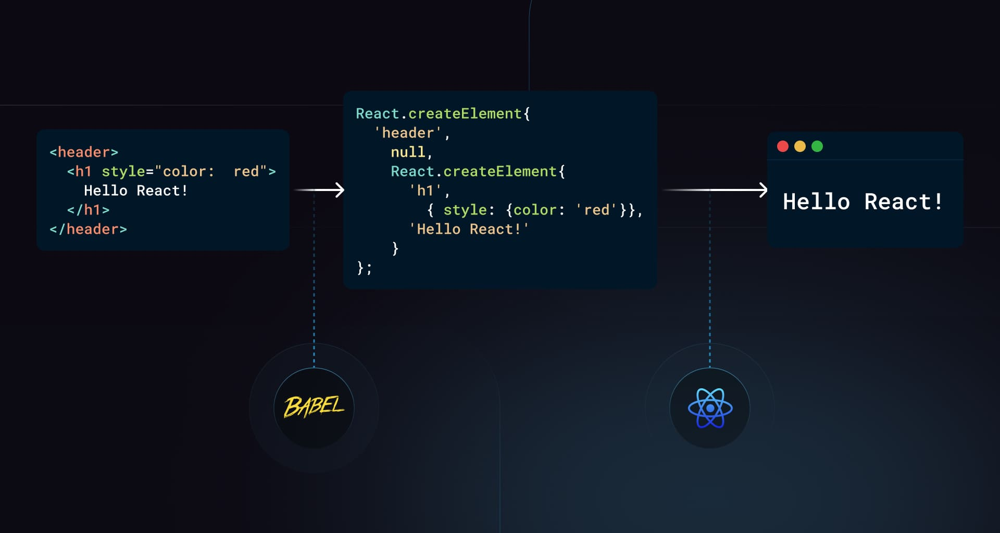
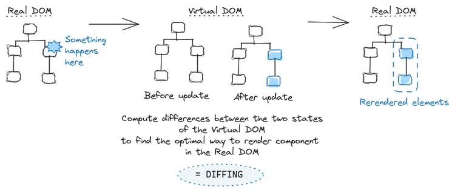

# React Interview Questions & Answers

---

### What is React?

- `JavaScript library` for `building user interfaces`.
- open- source, `component based library`, to create `reusable` UI components.
- created & maintained by `Facebook`.
- used to build single page applications (`SPA`).
- uses `virtual DOM` based mechanism to fill in data (views) in HTML DOM.

---

### What are the major features of React?

- `Component-Based Architecture`: Apps are built with `independent, reusable components` that return HTML via a render function.
- `Virtual DOM`: React uses an `in-memory DOM` to detect changes and `efficiently update` only what's needed in the real DOM.
- `JSX (JavaScript XML)`: A `syntax extension` that lets you write `HTML-like code in JavaScript`, enhancing readability and expressiveness.
- `Unidirectional Data Flow`: Data flows `one way (parent → child)`, making the app `more predictable and easier to debug`.
- `Declarative UI`: You `describe the UI for a given state`, and React `automatically updates the DOM` when data changes.
- `SPA` (Single Page Application) : A web app that loads a single HTML page and dynamically updates content without full page reloads.

---

### `npm` (Node Package Manager)

- `Used for:` `Installing packages`.
- `Command:` `npm install <package-name>`
- `Behavior:`

- Downloads and adds the package to your `node_modules` folder.
- Adds dependencies to `package.json` if used with `--save`.

#### Example:

```bash
npm install create-react-app
npx create-react-app my-app   # <-- this runs it
```

---

### `npx` (Node Package Executor)

- `Used for:` Running packages `without installing them globally`.
- `Command:` `npx <package-name>`
- `Behavior:`

- Runs the package directly.
- Downloads the package temporarily if it’s not already installed.
- Useful for `one-time commands` or `project setup scripts`.

#### Example:

```bash
npx create-react-app my-app
```

- This runs the `create-react-app` package `without installing` it globally.

#### ✅ When to Use What?

| Use case                         | Use `npm`               | Use `npx`                        |
| -------------------------------- | ----------------------- | -------------------------------- |
| Install and reuse a package      | ✅ `npm install lodash` | ❌                               |
| Run a package once (e.g., setup) | ❌                      | ✅ `npx create-react-app my-app` |
| Avoid polluting global installs  | ❌                      | ✅                               |

---

### How to create react project?

#### ✅ Option 1: Using `create-react-app` (Beginner-Friendly)

#### 🔧 Command:

```bash
npx create-react-app my-app
```

#### 📦 What it does:

- Sets up a fully configured React project (`Webpack`, `Babel`, `ESLint`, etc.)
- Includes folder structure, dev server, and build tools

#### 📂 Structure:

```
my-app/
├── node_modules/
├── public/
├── src/
│   └── App.js
├── package.json
└── README.md
```

#### ▶️ Run the app:

```bash
cd my-app
npm start
```

#### ✅ Option 2: Using Vite (Faster, Modern Approach)

#### 🔧 Command:

```bash
npm create vite@latest my-app --template react
```

or for TypeScript:

```bash
npm create vite@latest my-app --template react-ts
```

#### ▶️ Setup:

```bash
cd my-app
npm install
npm run dev
```

#### ⚡ Benefits of Vite:

- Lightning-fast dev server
- Hot Module Replacement (HMR)
- Better suited for modern React apps

#### ✅ Option 3: Manual Setup (Advanced)

If you want full control over every tool (Webpack, Babel, etc.), you can:

1. Initialize project:

```bash
npm init -y
```

2. Install dependencies:

```bash
npm install react react-dom
npm install --save-dev webpack webpack-cli babel-loader @babel/core @babel/preset-react
```

3. Create config files (`webpack.config.js`, `.babelrc`)

This is useful for learning internals but not recommended for beginners.

#### Recommendation:

- 🧑‍🎓 Beginners: Use `create-react-app`
- ⚡ Pros/Performance: Use `Vite`
- 🔬 Custom control: `Manual setup`

---

### Compare `package.json` and `package-lock.json` in a React (or any Node.js) project:

| Feature                      | `package.json`                                     | `package-lock.json`                                    |
| ---------------------------- | -------------------------------------------------- | ------------------------------------------------------ |
| `Purpose`                    | Manages `project metadata` and `dependencies list` | Locks the `exact versions` of installed dependencies   |
| `Created/Edited By`          | Developers manually or via `npm install --save`    | Automatically by `npm` when dependencies are installed |
| `Includes Version Ranges`    | Yes (e.g., `^1.0.0`, `~2.1.0`)                     | No, stores `exact versions` (e.g., `1.0.5`)            |
| `Tracks Nested Dependencies` | ❌ Only direct dependencies                        | ✅ All (direct and nested) dependencies                |
| `Needed for Install?`        | ✅ Required for project setup                      | ✅ Ensures consistency across environments             |
| `Version Control`            | ✅ Must be tracked in Git                          | ✅ Should be committed to Git                          |
| `Human-Readable`             | ✅ Easier to read and edit                         | ⚠️ Large, auto-generated (not meant for manual edits)  |
| `Used by`                    | Both `npm` and `yarn`                              | Mainly `npm` (Yarn uses `yarn.lock`)                   |

#### Summary:

- Use `package.json` to declare what your app `needs`.
- Use `package-lock.json` to ensure everyone installs `exactly the same` versions.

---

### `dependencies` vs `devDependencies` in a Node.js/React project (`package.json`):

| Feature                    | `dependencies`                                  | `devDependencies`                                          |
| -------------------------- | ----------------------------------------------- | ---------------------------------------------------------- |
| `Purpose`                  | Packages required for the `application to run`  | Packages needed `only during development/testing`          |
| `Installed on Production`  | ✅ Yes                                          | ❌ No (unless explicitly included)                         |
| `Examples`                 | `react`, `react-dom`, `axios`, `redux`          | `eslint`, `jest`, `webpack`, `babel`, `vite`, `typescript` |
| `Usage`                    | Used in `runtime code` (in `src/`, client-side) | Used in `build tools, testing, and development setup`      |
| `Install command`          | `npm install <package>` or `--save`             | `npm install <package> --save-dev` or `-D`                 |
| `Should be in production?` | ✅ Yes                                          | ❌ No (kept out of production bundle)                      |

#### Example in `package.json`:

```json
{
  "dependencies": {
    "react": "^18.2.0",
    "axios": "^1.3.0"
  },
  "devDependencies": {
    "eslint": "^8.0.0",
    "jest": "^29.0.0"
  }
}
```

---

### What is JSX?

- JSX stands for `JavaScript XML`.
- Allows writing `HTML-like code inside JavaScript` files.
- React uses JSX to describe UI components in a `declarative way`.
- JSX gets converted into JavaScript function calls, often by Babel. For instance, `<div>Hello, world!</div>` is transformed into `React.createElement('div', null, 'Hello, world!')`.



If you don't use JSX syntax then the respective JavaScript code should be written as below,

```javascript
import { createElement } from "react";

export default function App() {
  return createElement(
    "h1",
    { className: "greeting" },
    "Hello, this is a JSX Code!"
  );
}
```

Functional Component

```javascript
export default function App() {
  return <h1 className="greeting">{"Hello, this is a JSX Code!"}</h1>;
}
```

Class Component

```javascript
class App extends React.Component {
  render() {
    return <h1 className="greeting">{"Hello, this is a JSX Code!"}</h1>;
  }
}
```

`Note:` JSX is stricter than HTML

---

### What is Virtual DOM?

- The `Virtual DOM (VDOM)` is a `lightweight JavaScript representation` of the real DOM.
- React uses it to `track changes` in the UI efficiently.
- When state or props change, React:

1. Creates a new Virtual DOM.
2. Compares it with the previous one (diffing).
3. Updates only the changed parts in the real DOM (reconciliation).

- This process boosts `performance and efficiency`, avoiding unnecessary DOM manipulations.



---

### Difference Between React Node, Element, and Component.

- A React Node refers to any unit that can be rendered in React, such as an element, string, number, or null.
- A React Element is an immutable object that defines what should be rendered, typically created using JSX or React.createElement.
- A React Component is either a function or class that returns React Elements, enabling the creation of reusable UI components.

---

### What is React Fiber?

- `React Fiber` is the `reconciliation engine` introduced in React 16.
- It’s a complete rewrite of the core algorithm that improves:

- `Incremental rendering`
- `Prioritization of updates`
- `Pause, abort, and resume work`

- Enables `better performance`, especially for animations and complex UI updates.
- Helps React handle large applications with `smoother UI rendering` and `fine-grained control` over component updates.

---

### 🔁 What is Reconciliation in React?

`Reconciliation` is the process React uses to `compare the new Virtual DOM` with the `previous one` to determine the `minimum number of changes` required to update the `real DOM`.

#### 🧠 Why It Matters:

- DOM updates are `expensive`, so React uses reconciliation to:

- `Identify differences` efficiently
- `Apply only necessary updates`
- `Boost performance`

#### ⚙️ How Reconciliation Works:

1. `Render Phase`:

- Your component re-renders due to state/prop changes.
- React creates a `new Virtual DOM`.

2. `Diffing Algorithm`:

- React compares the `new Virtual DOM` with the `previous one`.
- Uses heuristics (like `key` props) to detect changes.

3. `Update Phase`:

- React calculates the `minimal set of operations`.
- Then updates the `actual DOM` accordingly.

#### 🔑 Key Concepts in Reconciliation:

| Concept           | Explanation                                                             |
| ----------------- | ----------------------------------------------------------------------- |
| `Virtual DOM`     | Lightweight copy of the real DOM used to detect changes                 |
| `Keys`            | Help React identify which items changed in lists                        |
| `Pure Components` | Avoid unnecessary reconciliation by skipping re-renders with same props |

#### 🧪 Real-World Analogy:

Think of it like `editing a document`:

- You don’t rewrite the whole thing—you just fix the changed words.
- React does the same with the DOM during reconciliation.

---

### What is React.StrictMode

- tool for `highlighting potential problems` in a react application.
- activates `additional checks and warnings` for its descendants(child elements).
- checks are run in `development mode` only,they do not impact the production build.
- helps with the below things:
- Identifying components with unsafe lifecycles (componentWillMount)
- Warning about legacy string ref API usage
- Warning about deprecated findDOMNode() usage
- Detecting unexpected side effects
- Detecting legacy context API

```jsx
import React, { StrictMode } from "react";

<StrictMode>
  <App />
</StrictMode>;
```

Note: StrictMode renders components twice (on dev but not production) in order to
detect any problems with our code and warn us about them.

Here’s a `short yet in-depth summary` of `React Lifecycle Methods` (for `class components`, with functional equivalents noted):

---

### What are component LifeCycle Methods?

React components go through `3 main phases`:

#### 1. `Mounting` (component is being created and inserted into the DOM)

| Method                                          | Purpose                                                                   |
| ----------------------------------------------- | ------------------------------------------------------------------------- |
| `constructor()`                                 | Set initial state and bind methods.                                       |
| `static getDerivedStateFromProps(props, state)` | Sync state with props `before render`. Rarely used.                       |
| `render()`                                      | Returns JSX. `Pure function`.                                             |
| `componentDidMount()`                           | Called once after initial render. `Good for API calls, DOM manipulation.` |

🧠 `Hook equivalent`: useEffect(() => { ... }, \[]) → like `componentDidMount`

#### 2. `Updating` (props or state changes trigger re-renders)

| Method                                               | Purpose                                                  |
| ---------------------------------------------------- | -------------------------------------------------------- |
| `static getDerivedStateFromProps()`                  | Called before every render if props/state change.        |
| `shouldComponentUpdate(nextProps, nextState)`        | Return `false` to skip re-render. Used for optimization. |
| `render()`                                           | Re-renders JSX.                                          |
| `getSnapshotBeforeUpdate(prevProps, prevState)`      | Capture info (e.g., scroll position) before DOM updates. |
| `componentDidUpdate(prevProps, prevState, snapshot)` | Run side-effects `after update`.                         |

🧠 `Hook equivalents`:

- `useEffect(() => { ... }, [dependencies])`
- `useMemo()` or `React.memo()` → performance tuning

#### 3. `Unmounting` (component is removed from DOM)

| Method                   | Purpose                                                |
| ------------------------ | ------------------------------------------------------ |
| `componentWillUnmount()` | Cleanup work like clearing timers, removing listeners. |

🧠 `Hook equivalent`:

```jsx
useEffect(() => {
  return () => {
    // cleanup here
  };
}, []);
```

#### 4. `Error Handling Phase`

| Method                                   | Purpose                                                           |
| ---------------------------------------- | ----------------------------------------------------------------- |
| `componentDidCatch(error, info)`         | Catches errors from children. Useful for logging and fallback UI. |
| `static getDerivedStateFromError(error)` | Update state to show fallback UI.                                 |

🧠 `No direct hook`, but you can use `Error Boundaries` (class components only).

#### Summary Table

| Lifecycle  | Class Component Method                      | Functional Equivalent (Hook)  |
| ---------- | ------------------------------------------- | ----------------------------- |
| Mounting   | constructor, componentDidMount              | `useEffect(..., [])`          |
| Updating   | shouldComponentUpdate, componentDidUpdate   | `useEffect(..., [dep])`       |
| Unmounting | componentWillUnmount                        | cleanup inside `useEffect`    |
| Error      | componentDidCatch, getDerivedStateFromError | Error Boundaries (class only) |

#### `All-in-One Real-World Example (Chat App)`

```jsx
class ChatWindow extends React.Component {
  // Use: Initialize state, bind methods.
  // Real-world use: Set initial form values or timer counters.
  constructor(props) {
    super(props);
    this.state = { messages: [], error: false };
    // this.sendMessage = this.sendMessage.bind(this);
  }

  // Use: Sync props to state before render. Rarely needed.
  // Real-world use: Reset component state based on parent prop changes.
  static getDerivedStateFromProps(props, state) {
    if (props.reset) return { messages: [] };
    return null;
  }

  // Use: Runs once after initial render.
  // Real-world use: Ideal for API calls, subscriptions.
  componentDidMount() {
    this.fetchInterval = setInterval(() => {
      fetch("/api/messages")
        .then((res) => res.json())
        .then((data) => this.setState({ messages: data }));
    }, 3000);
  }

  // Use: Return false to skip re-render. Useful for performance.
  // Real-world use: Avoid unnecessary renders when data hasn't changed.
  shouldComponentUpdate(nextProps, nextState) {
    return nextState.messages.length !== this.state.messages.length;
  }

  // Use: Capture info (e.g., scroll) before DOM updates, and pass to componentDidUpdate.
  getSnapshotBeforeUpdate(prevProps, prevState) {
    const container = document.getElementById("chat-scroll");
    return container ? container.scrollHeight : null;
  }

  // Use: Run side effects after state/props change.
  componentDidUpdate(prevProps, prevState, snapshot) {
    const container = document.getElementById("chat-scroll");
    if (snapshot) container.scrollTop = container.scrollHeight - snapshot;
  }

  // Use: Cleanup before removal.
  // Real-world use: Cleanup polling, websocket, event listeners.
  componentWillUnmount() {
    clearInterval(this.fetchInterval);
  }

  // Use: Update state when child component throws an error.
  // Real-world use: Show fallback UI.
  static getDerivedStateFromError(error) {
    return { error: true };
  }

  // Use: Log error details to server or show alternative UI.
  // Real-world use: Error logging + fallback rendering.
  componentDidCatch(error, info) {
    console.error("Chat Error:", error, info);
  }

  // Use: Render JSX to DOM. Pure function.
  // Real-world use: Show UI based on props/state.
  render() {
    if (this.state.error) return <div>Error loading chat</div>;

    return (
      <div id="chat-scroll">
        {this.state.messages.map((msg, i) => (
          <p key={i}>{msg.text}</p>
        ))}
      </div>
    );
  }
}
```

---

### What are Pure Components in React?

- It is a component that `renders the same output` for the `same props and state`.
- It implements `shouldComponentUpdate()` with a `shallow comparison` of props and state.
- Helps in `avoiding unnecessary re-renders`.

#### ✅ Syntax (Class Component):

```tsx
import React, { PureComponent } from "react";

class MyComponent extends PureComponent {
  render() {
    return <div>{this.props.name}</div>;
  }
}
```

#### ✅ Functional Component Equivalent:

Use `React.memo()`:

```tsx
const MyComponent = React.memo((props) => {
  return <div>{props.name}</div>;
});
```

#### 🧠 Key Points:

- Best for `performance optimization`.
- Only works with `primitive values` (or deeply memoized objects).
- Use when component's render output is `purely based on props/state`.

---

### React State

- `Definition:`
  State is a data structure that is managed within a component. It represents information that can change over the lifetime of the component.
- `Mutability:`
  State is mutable, meaning it can be changed using the setter function (`setState` in class components or the updater function from `useState` in functional components).
- `Scope:`
  State is local to the component where it is defined. Only that component can modify its own state.
- `Usage:`
  State is typically used for data that needs to change in response to user actions, network responses, or other dynamic events.
- `Re-rendering:`
  Updating the state triggers a re-render of the component and its descendants.

```javascript
import { useState } from "react";

function User() {
  const [message, setMessage] = useState("Welcome to React world");

  return (
    <div>
      <h1>{message}</h1>
    </div>
  );
}
```

Class Component

```javascript
import React from "react";
class User extends React.Component {
  constructor(props) {
    super(props);

    this.state = {
      message: "Welcome to React world",
    };
  }

  render() {
    return (
      <div>
        <h1>{this.state.message}</h1>
      </div>
    );
  }
}
```

---

### React Prop

- `Definition:`
  Props (short for “properties”) are inputs to a component, provided by its parent component.
- `Mutability:`
  Props are read-only. A component cannot modify its own props; they are immutable from the component’s perspective.
- `Scope:`
  Props are used to pass data and event handlers down the component tree, enabling parent components to configure or communicate with their children.
- `Usage:`
  Props are commonly used to make components reusable and configurable. They allow the same component to be rendered with different data or behavior.
- `Analogy:`
  Think of props as arguments to a function, whereas state is like variables declared inside the function.

```jsx
import React from "react";

const ChildComponent = (props) => {
  return (
    <div>
      <p>{props.name}</p>
      <p>{props.age}</p>
      <p>{props.gender}</p>
    </div>
  );
};

const ParentComponent = () => {
  return (
    <div>
      <ChildComponent name="John" age="30" gender="male" />
      <ChildComponent name="Mary" age="25" geneder="female" />
    </div>
  );
};
```

Class Component

```jsx
class ChildComponent extends React.Component {
  render() {
    return (
      <div>
        <p>{this.props.name}</p>
        <p>{this.props.age}</p>
        <p>{this.props.gender}</p>
      </div>
    );
  }
}
```

#### Summary Table

| Feature    | State                              | Props                              |
| ---------- | ---------------------------------- | ---------------------------------- |
| Managed by | The component itself               | Parent component                   |
| Mutable    | Yes                                | No (read-only)                     |
| Scope      | Local to the component             | Passed from parent to child        |
| Usage      | Manage dynamic data and UI changes | Configure and customize component  |
| Update     | Using setState/useState            | Cannot be updated by the component |

### What is the difference between HTML and React event handling?

1. In HTML, the event name usually represents in `lowercase as a convention:

```html
<button onclick="activateLasers()"></button>
```

Whereas in React it follows _camelCase_ convention:

```javascript
<button onClick={activateLasers}>
```

2. In HTML, you can return `false` to prevent default behavior:

```html
<a href="#" onclick='console.log("The link was clicked."); return false;' />
```

Whereas in React you must call `preventDefault()` explicitly:

```javascript
function handleClick(event) {
  event.preventDefault();
  console.log("The link was clicked.");
}
```

3. In HTML, you need to invoke the function by appending `()`, Whereas in react you should not append `()` with the function name. (refer "activateLasers" function in the first point for example)

---

### What are Synthetic Events in React?

- Synthetic events in React are a `wrapper around native DOM events` that ensure `consistent behavior across browsers`.
- They normalize the way events are handled, providing a unified API for React applications.

- These events are wrapped in the `SyntheticEvent` object and offer methods like `preventDefault()` and `stopPropagation()` to control event behavior.
- React uses event pooling to reuse event objects, which helps optimize performance.

#### ✅ Example:

```tsx
function Button() {
  const handleClick = (event: React.MouseEvent<HTMLButtonElement>) => {
    console.log("Clicked!", event);
  };

  return <button onClick={handleClick}>Click Me</button>;
}
```

#### 🧠 Key Features:

| Feature                 | Description                                                                        |
| ----------------------- | ---------------------------------------------------------------------------------- |
| `Cross-browser`         | Normalizes event behavior across different browsers.                               |
| `Event pooling`         | React used to reuse event objects for performance (deprecated in React 17+).       |
| `Same API`              | Works similarly to native DOM events (e.g., `event.target`).                       |
| `SyntheticEvent object` | Contains all standard properties/methods like `stopPropagation`, `preventDefault`. |

#### Types of Synthetic Events:

- `MouseEvent`
- `KeyboardEvent`
- `FocusEvent`
- `ChangeEvent`
- `FormEvent`, etc.

### What Are Inline Conditional Expressions in React?

`Inline conditional expressions` are a way to conditionally render elements `directly inside JSX`, often using `ternary operators` or `logical AND (&&)`.

---

#### ✅ Common Patterns

#### 1. `Ternary Operator`

```tsx
{
  isLoggedIn ? <LogoutButton /> : <LoginButton />;
}
```

- Best when you need to choose between `two components or values`.

---

#### 2. `Logical AND (`&&`)`

```tsx
{
  isAdmin && <AdminPanel />;
}
```

- Renders `AdminPanel` `only if` `isAdmin` is truthy.

---

#### 🧠 Use Cases

| Expression     | Use When You Need To...                            |
| -------------- | -------------------------------------------------- |
| `cond ? A : B` | Choose between two elements                        |
| `cond && A`    | Conditionally render one element if condition true |
| `!cond && A`   | Show an element if condition is false              |

---

#### ❗ Caveats

- `false`, `null`, and `undefined` won’t render anything.
- `0` will `render`, which may be unexpected:

```tsx
{
  0 && <Component />;
} // renders 0 (not empty)
```

### 🔑 What is the `key` Prop in React?

- The `key` prop is a `special attribute` used by React to `identify` which items in a list have `changed, been added, or removed`.
- It helps `React optimize rendering` and `improve performance` by minimizing DOM updates.

#### ✅ Syntax Example:

```tsx
const users = ["Alice", "Bob", "Charlie"];

<ul>
  {users.map((user) => (
    <li key={user}>{user}</li>
  ))}
</ul>;
```

#### 🧠 Why `key` is Important:

| Purpose                   | Explanation                                                  |
| ------------------------- | ------------------------------------------------------------ |
| 🔄 Efficient Re-rendering | Helps React know what to re-render instead of replacing all. |
| 🧠 Keeps Component State  | Retains state when the list updates (like inputs in a form). |
| ⚠️ Avoids Bugs            | Prevents unwanted behavior in dynamic lists.                 |

#### 🚫 Bad `key` Usage:

```tsx
// DO NOT use index as key if list is dynamic or reorderable
<li key={index}>{item}</li>
```

- Using array `indices` as `keys` can lead to performance issues and unexpected behavior, especially when `reordering` or `deleting` items.
- React relies on keys to identify `elements uniquely`, and using indices can cause components to be re-rendered unnecessarily or display incorrect data.

#### ✅ Best Practice:

- Use `unique, stable IDs` from your data (e.g., user ID, database ID).

```tsx
<li key={user.id}>{user.name}</li>
```

#### 🔁 Force Re-render Using `key`

- Changing a component’s `key` forces React to `unmount and remount` it.
- Useful for resetting state or restarting component lifecycle.

```tsx
<Component key={someUniqueValue} />
```

---

### What are controlled components?

- In React, a `controlled component` is a form element (like input, textarea, select) whose `value is controlled by React state`.
- The input’s value is `tied to a state variable`, and changes are handled via `onChange`.

---

#### ✅ Example:

```tsx
const [name, setName] = useState("");

<input value={name} onChange={(e) => setName(e.target.value)} />;
```

---

### Key Points:

- React has full control over the form data.
- Makes validation, formatting, and conditional rendering easier.
- Ensures a `single source of truth` (React state).

---

### What are uncontrolled components?

- `Uncontrolled components` are form elements where the `DOM itself manages the state`, not React.
- React accesses the input values using `ref` instead of `useState`.

### ✅ Example:

```tsx
import { useRef } from "react";

function Form() {
  const inputRef = useRef<HTMLInputElement>(null);

  const handleSubmit = () => {
    alert(inputRef.current?.value);
  };

  return (
    <>
      <input type="text" defaultValue="Hello" ref={inputRef} />
      <button onClick={handleSubmit}>Submit</button>
    </>
  );
}
```

### 🧠 Key Points:

- Uses `defaultValue` instead of `value`.
- Easier for `simple forms`, file uploads, or 3rd-party integrations.
- React doesn’t track or control user input in real-time.
- Less code, but `less control` (harder to do validation, conditional rendering, etc.).

---

### Difference Between Controlled and Uncontrolled Components

| Feature           | Controlled Component                              | Uncontrolled Component                            |
| ----------------- | ------------------------------------------------- | ------------------------------------------------- |
| `Data Source`     | React state                                       | DOM (internal state of the element)               |
| `Value Access`    | Via `state`                                       | Via `ref`                                         |
| `Form Control`    | Fully controlled by React                         | Partially managed by the DOM                      |
| `Use Case`        | Complex forms, validation, conditional logic      | Simple forms or when less React control is needed |
| `Example Input`   | `<input value={value} onChange={handleChange} />` | `<input defaultValue="John" ref={inputRef} />`    |
| `Code Complexity` | Slightly more verbose                             | Simpler, less boilerplate                         |

---

### What is the difference between createElement and cloneElement?

- `createElement`

- Used to create a new React element.
- It takes the type of the element (e.g., 'div', a React component), props, and children, and returns a new React element.
- Commonly used internally by JSX or when dynamically creating elements. Example:

```js
React.createElement("div", { className: "container" }, "Hello World");
```

- `createElement`

- Used to clone an existing React element and optionally modify its props.
- It allows you to clone a React element and pass new props or override the existing ones, keeping the original element's children and state.
- Useful when you want to manipulate an element without recreating it. Example:

```jsx
const element = <button className="btn">Click Me</button>;
const clonedElement = React.cloneElement(element, {
  className: "btn-primary",
});
```

---

### Explain one-way data flow of React.

- means data moves from parent to child components through props.

- Parent to Child: The parent passes data to the child.
- State Updates: To change data, the child calls a function passed down by the parent.

```jsx
function Parent() {
  const [count, setCount] = React.useState(0);
  return <Child count={count} increment={() => setCount(count + 1)} />;
}

function Child({ count, increment }) {
  return <button onClick={increment}>Count: {count}</button>;
}
```

> This ensures data flows in one direction, making the app more predictable.

### What is Lifting State Up in React?

- When several components need to `share the same changing data` then it is recommended to `lift the shared state up` to their closest common ancestor.
- That means if two child components share the same data from its parent, then move the state to parent instead of maintaining local state in both of the child components.

---

### What are the benefits of using hooks in React?

- Hooks enable the use of `state` and `other React features` in functional components, removing the need for class components.
- They streamline code by reducing the reliance on `lifecycle methods`, enhance `readability`, and facilitate the reuse of `stateful` logic across components.
- Popular hooks like `useState` and `useEffect` are used for managing state and side effects.

---

### What are the rules of React hooks?

- React hooks should be called `at the top level` of a function
- `not` inside `loops`, `conditions`, or `nested functions`.
- They must only be used within `React function components` or `custom hooks`.

---

### What is the difference between `useEffect` and `useLayoutEffect` in React?

useEffect and useLayoutEffect both handle side effects in React functional components but differ in when they run:

- `useEffect` runs `asynchronously` after the `DOM has rendered`, making it suitable for tasks like `data fetching` or `subscriptions`.
- `useLayoutEffect` runs `synchronously` after DOM updates but `before the browser paints`, ideal for tasks like `measuring DOM elements` or `aligning the UI` with the DOM. Example:

```jsx
import React, { useEffect, useLayoutEffect, useRef } from "react";

function Example() {
  const ref = useRef();

  useEffect(() => {
    console.log("useEffect: Runs after DOM paint");
  });

  useLayoutEffect(() => {
    console.log("useLayoutEffect: Runs before DOM paint");
    console.log("Element width:", ref.current.offsetWidth);
  });

  return <div ref={ref}>Hello</div>;
}
```

---

### What does the dependency array of useEffect affect?

The dependency array of useEffect controls when the effect re-runs:

- If it's empty, the effect runs only once after the initial render.
- If it contains variables, the effect re-runs whenever any of those variables change.
- If omitted, the effect runs after every render.

---

### What is the useRef hook in React and when should it be used?

- The useRef hook creates a mutable object that `persists through renders`, allowing `direct access to DOM` elements, s`toring mutable values without causing re-renders`, and maintaining `references` to values.
- For instance, useRef can be utilized to focus on an input element:

```jsx
import React, { useRef, useEffect } from "react";

function TextInputWithFocusButton() {
  const inputEl = useRef(null);
  useEffect(() => {
    inputEl.current.focus();
  }, []);
  return <input ref={inputEl} type="text" />;
}
```

---

### What is the purpose of callback function argument format of `setState()` in React and when should it be used?

- ensures that state updates are based on the most current state and props.
- essential when the new state depends on the previous state.
- Instead of passing an object directly to setState(), you provide a function that takes the previous state and props as arguments, returning the updated state.

```jsx
this.setState((prevState, props) => ({
  counter: prevState.counter + props.increment,
}));
```

> Using this approach helps avoid issues related to asynchronous updates, ensuring that your state reflects the latest values accurately.

---

### What is the `useCallback` hook in React and when should it be used?

- `memoizes functions` to prevent their recreation on every render.
- beneficial when passing `callbacks to optimized child components` that depend on reference equality to avoid unnecessary renders. Use it when a function is passed as a prop to a child component.

```jsx
const memoizedCallback = useCallback(() => {
  doSomething(a, b);
}, [a, b]);
```

---

### What is the `useMemo` hook in React and when should it be used?

- `memoizes costly calculations`, recomputing them only when dependencies change.
- enhances performance by avoiding unnecessary recalculations.
- It should be used for computationally intensive functions that don't need to run on every render.

```jsx
const memoizedValue = useMemo(() => computeExpensiveValue(a, b), [a, b]);
```

---

### What is the `useReducer` hook in React and when should it be used?

- `manages complex state logic` in functional components, serving as an alternative to useState.
- ideal when state has multiple sub-values or when the next state relies on the previous one.
- It accepts a reducer function and an initial state.

```jsx
const [state, dispatch] = useReducer(reducer, initialState);
```

---

### What is the `useId` hook in React and when should it be used?

- generates `unique IDs for elements` within a component, which is crucial for accessibility by linking form inputs with labels.
- It guarantees unique IDs across the application even if the component renders multiple times.

```jsx
import { useId } from "react";

function MyComponent() {
  const id = useId();
  return (
    <div>
      <label htmlFor={id}>Name:</label>
      <input id={id} type="text" />
    </div>
  );
}
```

---

### What are some pitfalls of using context in React?

- Context in React can lead to performance issues if not handled carefully, causing unnecessary re-renders of components that consume the context, even if only part of the context changes.
- Overusing context for state management can also make the code harder to maintain and understand.
- It's best to use context sparingly and consider other state management solutions like Redux or Zustand for more complex scenarios.

---

### How would one optimize the performance of React contexts to reduce rerenders?

- Optimizing context performance involves memoizing context values with useMemo, splitting contexts for isolated state changes, and employing selectors to rerender only necessary components.

```jsx
const value = useMemo(() => ({ state, dispatch }), [state, dispatch]);
```

---

### What does re-rendering mean in React?

- refers to the process of `updating the user interface (UI)` in response to `changes in the component's state or props`.
- When the `state or props of a component change`, React `re-renders` the component to reflect the `updated data in the UI`.

This involves:

- Recalculating the JSX returned by the component.
- Comparing the new JSX with the previous one (using the Virtual DOM).
- Updating the real DOM with only the differences (efficient rendering).
- Re-rendering ensures that the UI stays in sync with the component's state and props.

---

### What is `forwardRef()` in React used for?

- allows `passing a ref through a component` to one of its children.
- This is useful for accessing a DOM element or child component's instance directly from a parent.
- after React 19, not used. handled by react

```jsx
import React, { forwardRef } from "react";

const MyComponent = forwardRef((props, ref) => <input ref={ref} {...props} />);
```

---

### Can you explain how to create and use custom hooks in React?

- Create a function that `starts with use` and uses built-in hooks like useState or useEffect
- Return the values or functions you want to share.
  Example:

```jsx
function useForm(initialState) {
  const [formData, setFormData] = useState(initialState);
  const handleChange = (e) =>
    setFormData({ ...formData, [e.target.name]: e.target.value });
  return [formData, handleChange];
}
```

Use the Hook:

```jsx
function MyForm() {
  const [formData, handleChange] = useForm({ name: "", email: "" });
  return <input name="name" value={formData.name} onChange={handleChange} />;
}
```

> Custom hooks let you reuse logic across components, keeping your code clean.

---

### What are some React anti-patterns?

React anti-patterns are practices that can lead to inefficient or hard-to-maintain code. Common examples include:

- Directly mutating state instead of using setState
- Using componentWillMount for data fetching
- Overusing componentWillReceiveProps
- Not using keys in lists
- Excessive inline functions in render
- Deeply nested state

---

### How do you decide between using React state, context, and external state managers?

- depends on your application's complexity.
- Use React state for local component state
- context for global state shared across multiple components
- external managers like Redux or MobX for complex state management requiring advanced features.

---

### Explain what happens when setState is called in React.

When setState is called in React:

- `State Update`: It updates the component's state, triggering a re-render of the component.
- `Batching`: React may batch multiple setState calls into a single update for performance optimization.
- `Re-render`: React re-renders the component (and its child components if needed) with the new state.
- `Asynchronous`: State updates may be asynchronous, meaning React doesn't immediately apply the state change; it schedules it for later to optimize performance.
  Example:

```jsx
function Counter() {
  const [count, setCount] = React.useState(0);

  const increment = () => {
    setCount(count + 1); // Calls setState to update state
  };

  return <button onClick={increment}>Count: {count}</button>;
}
```

> In this example, calling setState (via setCount) triggers a re-render with the updated count.

---

### Explain prop drilling.

- Prop drilling is when you pass data from a parent component to a deeply nested child component through props, even if intermediate components don't use it.

Example:

```jsx
function Grandparent() {
  const data = "Hello from Grandparent";
  return <Parent data={data} />;
}

function Parent({ data }) {
  return <Child data={data} />;
}

function Child({ data }) {
  return <p>{data}</p>;
}
```

> In this example, data is passed through multiple components, even though only the Child component uses it.

---

### Describe lazy loading in React.

- a technique where components are loaded only when they are needed, rather than at the initial page load.
- This helps reduce the initial load time and improve performance by splitting the code into smaller chunks.

Example:

```jsx
import React, { Suspense, lazy } from "react";

const LazyComponent = lazy(() => import("./LazyComponent"));

function App() {
  return (
    <Suspense fallback={<div>Loading...</div>}>
      <LazyComponent />
    </Suspense>
  );
}
```

> In this example, LazyComponent is loaded only when it's rendered, and while loading, a fallback UI (Loading...) is displayed.

---

### What is Concurrent Mode in React, and how does it improve rendering performance?

- Concurrent Mode `allows React to work on multiple tasks simultaneously without blocking the main UI thread`.
- It enables React to `prioritize updates` and `provide smoother rendering` for complex applications.

---

### How does React handle concurrent rendering with multiple updates and prioritize them?

- React uses the `priority system` in Concurrent Mode `to schedule updates`.
- It can break up `large updates into smaller chunks` and give priority to user interactions (like clicks or input) to ensure the app remains responsive.

---

### How would you handle long-running tasks or expensive computations in React applications without blocking the UI?

- To avoid blocking the UI, `use Web Workers, setTimeout, or requestIdleCallback` for offloading heavy computations.
- Alternatively, break tasks into smaller parts and use React's `Suspense` or `useMemo` to only recompute when necessary.

Example using setTimeout for deferring computation:

```jsx
const [data, setData] = useState(null);

useEffect(() => {
  setTimeout(() => {
    const result = computeExpensiveData();
    setData(result);
  }, 0);
}, []);
```

---

### Explain server-side rendering of React applications and its benefits.

- Server-side rendering (SSR) involves rendering components on the server before sending fully rendered HTML to clients, improving initial load times and SEO through efficient hydration processes.

## 

### Explain static generation of React applications.

- Static generation pre-renders HTML at build time instead of runtime; this approach enhances performance by delivering static content quickly while improving SEO outcomes.

### What are Higher-Order Components (HOCs)?

- A `Higher-Order Component (HOC)` is a `function` that takes a component and returns a new enhanced component.
- It is a `pattern for code reuse` in React.

#### ✅ Syntax:

```tsx
const EnhancedComponent = withSomething(OriginalComponent);
```

#### 🧠 Purpose:

- Add `shared logic` (like logging, authentication, theming) without repeating code.
- Work like wrappers: take an existing component and return an extended version.

#### ✅ Real-World Example:

```tsx
// Use: Props logger
function withLogger(WrappedComponent) {
  return function (props) {
    console.log("Props:", props);
    return <WrappedComponent {...props} />;
  };
}
// Usage
const LoggedButton = withLogger(Button);

// Use: Redirect unauthenticated users.
const withAuth = (Component) => {
  return (props) => {
    const isLoggedIn = localStorage.getItem("token");
    return isLoggedIn ? <Component {...props} /> : <Navigate to="/login" />;
  };
};
// Usage:
export default withAuth(Dashboard);

// Use: Pass global config or theme values.
const withTheme = (Component) => (props) => {
  const theme = { primary: "blue", dark: true };
  return <Component {...props} theme={theme} />;
};
// Usage
export default withTheme(Header);

// Use: Log component views or interactions.
const withAnalytics = (Component) => {
  return (props) => {
    useEffect(() => {
      console.log(`Component ${Component.name} mounted`);
    }, []);
    return <Component {...props} />;
  };
};
```

#### 📝 Key Points:

- HOCs do `not modify` the original component.
- Common use cases: authentication (`withAuth`), theming (`withTheme`), data fetching (`withData`).
- `Convention:` HOC names start with `with`.
- `Prefer custom hooks` in modern functional components.
- Avoid deeply nested HOCs → can make debugging harder (known as “wrapper hell”).

---

### What is `children` Prop in React?

- The `children` prop is a `special prop` automatically passed to every component.
- It represents the `content nested between the opening and closing tags` of a component.

#### ✅ Example:

```tsx
function Wrapper({ children }) {
  return <div className="box">{children}</div>;
}

// Usage
<Wrapper>
  <p>Hello from inside!</p>
</Wrapper>;
```

Here, the `<p>` element is passed as `children` to `Wrapper`.

#### 🧠 Key Points:

- `children` can be:

- A single element
- Multiple elements
- Text
- A function (in advanced patterns)

- Useful for creating `reusable layouts`, `modal components`, `wrappers`, etc.

---

### How to write comments in React?

- The comments in React/JSX are similar to JavaScript Multiline comments but are wrapped in curly braces.

`Single-line comments:`

```javascript
<div>
  {/* Single-line comments(In vanilla JavaScript, the single-line comments are represented by double slash(//)) */}
  {`Welcome ${user}, let's play React`}
</div>
```

`Multi-line comments:`

```javascript
<div>
  {/* Multi-line comments for more than
one line */}
  {`Welcome ${user}, let's play React`}
</div>
```

---

### All the major updates in React 19

#### 🧩 1. **New Hooks & Form/Action APIs**

- `useActionState` (previously `useFormState`): streamlines async form submissions—handles pending, success/error, resets form automatically—reducing boilerplate.

```jsx
import { useActionState } from "react";

async function updateProfile(formData) {
  const res = await fetch("/api/update", {
    method: "POST",
    body: formData,
  });
  if (!res.ok) return "Update failed";
  return null;
}

function ProfileForm() {
  const [error, formAction, isPending] = useActionState(updateProfile, null);

  return (
    <form action={formAction}>
      <input name="name" placeholder="Your name" />
      <button disabled={isPending}>Save</button>
      {error && <p className="text-red-500">{error}</p>}
    </form>
  );
}
```

- `useFormStatus`: lets nested components read the state of their parent `<form>` (pending, data, method, etc.) without prop drilling.

```jsx
import { useFormStatus } from "react-dom";

function SubmitButton() {
  const { pending } = useFormStatus();
  return <button disabled={pending}>{pending ? "Processing…" : "Pay"}</button>;
}

export default function PaymentForm() {
  async function processPayment(formData) {
    await fetch("/api/charge", { method: "POST", body: formData });
  }

  return (
    <form action={processPayment}>
      <input name="card" placeholder="Card number" />
      <SubmitButton />
    </form>
  );
}
```

- `useOptimistic`: supports optimistic UI updates during async actions, automatically reverting if needed.

```jsx
import { useOptimistic, useState } from "react";

export default function CommentForm() {
  const [comments, setComments] = useState([]);

  const [optimisticComments, addOptimisticComment] = useOptimistic(
    comments,
    (state, newComment) => [newComment, ...state] // ⬆️ Add on top
  );

  async function submit(formData) {
    const text = formData.get("comment");
    const optimistic = { text, pending: true };
    addOptimisticComment(optimistic);

    try {
      const res = await fetch("/api/comment", {
        method: "POST",
        body: formData,
      });
      if (!res.ok) throw new Error();
      const saved = await res.json();
      setComments([saved, ...comments]); // ✅ Confirmed comment
    } catch {
      alert("Failed to post comment!");
      setComments([...comments]); // ❌ Reset optimistic one
    }
  }

  return (
    <form action={submit}>
      <input name="comment" placeholder="Add comment..." required />
      <button>Post</button>
      <ul>
        {optimisticComments.map((c, i) => (
          <li key={i}>
            {c.text} {c.pending && "(sending...)"}
          </li>
        ))}
      </ul>
    </form>
  );
}
```

- `use()` Primitive: allows components to **unwrap promises or async contexts directly in render**, compatible with Suspense.

```jsx
// Server-rendered comments fetched from API
import { use } from "react";

function Comments({ commentsPromise }) {
  // `use` will suspend until the promise resolves.
  const comments = use(commentsPromise);
  return comments.map((comment) => <p key={comment.id}>{comment}</p>);
}

function Page() {
  const commentsPromise = fetch("/api/comments").then((res) => res.json());

  // When `use` suspends in Comments,
  // this Suspense boundary will be shown.
  return (
    <Suspense fallback={<div>Loading...</div>}>
      <Comments commentsPromise={commentsPromise} />
    </Suspense>
  );
}

// context
const theme = use(ThemeContext);
```

**Real-world benefits**:

- Easier form handling with reduced state/pending logic.
- Cleaner optimistic updates (e.g., shopping cart, chats).
- Simplified async data fetching and SSR with Suspense.

#### ⚙️ 2. **React Compiler & Performance Optimizations**

- **Built-in compiler** automatically handles memoization, removing the need for explicit `useMemo`, `useCallback`, or `React.memo()`.
- Components are faster by default—fewer manual performance optimizations needed.

#### 🌐 3. **Server Components & SSR Enhancements**

- Deeper support for React **Server Components**: isolated server-side rendering during build or on each request, minimizing client JavaScript .
- **Improved hydration error reporting**: clear diffs and merged error messages for mismatch issues .

```jsx
// Product.server.js – rendered on the server
export default function Product({ productId }) {
  const product = fetchProductFromDB(productId); // Server-only DB call
  return (
    <div>
      {product.name} - ₹{product.price}
    </div>
  );
}
```

#### 🔄 4. **Simplified APIs & Dev Experience**

- **Dropping `forwardRef`**: now you can pass refs like normal props without using `React.forwardRef`.

```jsx
function MyInput({ placeholder, ref }) {
  return <input placeholder={placeholder} ref={ref} />;
}

//...
<MyInput ref={ref} />;
```

- **Clean context provider syntax**: use `<Context value="...">` instead of `<Context.Provider>`.

```jsx
// theme-context.js
export const ThemeContext = React.createContext("light");

// App.jsx
import { ThemeContext } from "./theme-context";

function App() {
  return (
    // no more <ThemeContext.Provider value="dark">
    <ThemeContext value="dark">
      <Header />
      <Main />
    </ThemeContext>
  );
}
```

- **Ref callback cleanup**: `ref={el => { …; return cleanup }}` pattern now officially supported .

```jsx
function Example() {
  const setRef = (el) => {
    if (!el) return;
    el.addEventListener("click", handleClick);

    return () => {
      el.removeEventListener("click", handleClick);
    };
  };

  return <button ref={setRef}>Click</button>;
}
```

#### 🎯 5. **Asset & Resource Loading Improvements**

- **Enhanced async `<script>` support**: add scripts at any position in the tree without duplication, ensured single execution .
- **Resource preloading APIs**: supports `<link rel="preload">`, DNS prefetch, font preloading, etc., declaratively in JSX .
- **Stylesheet management**: control stylesheet precedence for SSR/hydration correctness .

#### 🏷️ 6. **Document Metadata Handling**

- Use inline `<title>`, `<meta>`, `<link>`, and `<DocumentHead>` components—React handles SSR/meta injection automatically, replacing libraries like `react-helmet`.

```jsx
function BlogPost({ post }) {
  return (
    <article>
      <h1>{post.title}</h1>
      <title>{post.title}</title>
      <meta name="author" content="Josh" />
      <link rel="author" href="https://twitter.com/joshcstory/" />
      <meta name="keywords" content={post.keywords} />
      <p>Eee equals em-see-squared...</p>
    </article>
  );
}
```

#### 🧪 7. **Custom & Web Components Integration**

- Full compatibility with **Web Components**; you can seamlessly render `<x-custom-element />` within React .

#### 🧼 8. **General Developer Productivity**

- **Codemods for migration**: e.g., `replace-use-form-state`, `replace-reactdom-render`, `replace-string-ref`, `prop‑types‑typescript` via the React codemod tool.
- **New JSX transform required**: React 19 emphasizes named imports over default ones—some migration effort needed ([reddit.com][8]).

#### Summary

1. **New form/action hooks** → simplified async forms & UI feedback.
2. **Optimistic updates & suspense-friendly rendering** with `use()` & `useOptimistic`.
3. **Zero boilerplate performance** → skip `useMemo`, `useCallback`, `memo`.
4. **Cleaner APIs**: refs, context, scripts, assets, metadata, hydration.
5. **Server Components & SSR improvements** → faster, lighter bundles.

### Does the lazy function support named exports?

No, `React.lazy()` does not support named exports.

#### ✅ It `only supports default exports`.

When using `React.lazy()`, you `must export the component as the default export` from the module you're importing.

#### ❌ `Incorrect (named export)`:

```tsx
// MyComponent.tsx
export const MyComponent = () => <div>Hello</div>;

// App.tsx
const LazyComponent = React.lazy(() => import("./MyComponent")); // ❌ This will fail!
```

#### ✅ `Correct (default export)`:

```tsx
// MyComponent.tsx
const MyComponent = () => <div>Hello</div>;
export default MyComponent;

// App.tsx
const LazyComponent = React.lazy(() => import("./MyComponent")); // ✅ Works!
```

#### ✅ Workaround for Named Exports:

If you still want to use named exports, you can `re-export as default` during import:

```tsx
// Lazy import with named export workaround
const LazyComponent = React.lazy(() =>
  import("./MyComponent").then((module) => ({ default: module.MyComponent }))
);
```

### Why Does React Use `className` Instead of `class`?

- `class` is a `reserved keyword in JavaScript` (used for defining classes).
- To avoid conflicts and confusion, React uses `className` as the attribute for specifying CSS classes in JSX.

#### 🧠 Other Attribute Name Differences in React

| HTML Attribute | JSX Equivalent | Why the Change?                             |
| -------------- | -------------- | ------------------------------------------- |
| `class`        | `className`    | `class` is reserved in JS                   |
| `for`          | `htmlFor`      | `for` is a reserved keyword (used in loops) |
| `tabindex`     | `tabIndex`     | React uses **camelCase** for DOM attributes |
| `readonly`     | `readOnly`     | JSX uses **camelCase**                      |
| `maxlength`    | `maxLength`    | Follows camelCase for consistency           |
| `autocomplete` | `autoComplete` | camelCase DOM props                         |
| `enctype`      | `encType`      | camelCase again                             |
| `spellcheck`   | `spellCheck`   | camelCase                                   |

- In JSX, **most HTML attributes use camelCase**, and **some keywords are renamed** to avoid JavaScript conflicts.

---

### What Are Fragments in React?

- `Fragments` let you group a list of children `without adding extra nodes` to the DOM.
- Useful when you want to return multiple elements from a component `without wrapping them in a div or other container`.

#### Why Use Fragments?

- Avoid unnecessary `extra wrappers` in the DOM.
- Keeps the DOM cleaner and more semantic.
- Helps prevent layout or styling issues caused by extra elements.

#### Note:

- Short syntax `<>...</>` `does not support keys or attributes`.
- Use `<React.Fragment key={someKey}>...</React.Fragment>` when keys are needed (e.g., in lists).

---

### What Are Portals in React?

- `Portals` provide a way to render a React component’s children `into a DOM node outside the parent component’s DOM hierarchy`.
- Useful for things like `modals, tooltips, dropdowns`, or any UI that need to escape parent overflow or z-index constraints.

#### Syntax:

```jsx
import ReactDOM from "react-dom";

function Modal({ children }) {
  return ReactDOM.createPortal(
    children,
    document.getElementById("modal-root") // separate DOM node outside app root
  );
}
```

#### Example:

```jsx
function App() {
  return (
    <>
      <h1>App Content</h1>
      <Modal>
        <div className="modal">This is a modal rendered via Portal!</div>
      </Modal>
    </>
  );
}
```

#### Key Points:

| Feature                 | Description                                   |
| ----------------------- | --------------------------------------------- |
| `Maintains React tree`  | Keeps parent-child relationship in React code |
| `DOM placement control` | Renders children elsewhere in the DOM         |
| `Useful for UI layers`  | Ideal for modals, tooltips, popovers          |

---

### Stateless Components vs Stateful Components in React

| Aspect             | Stateless Components                                                            | Stateful Components                                                  |
| ------------------ | ------------------------------------------------------------------------------- | -------------------------------------------------------------------- |
| `Definition`       | Components that `do not manage state` internally; purely render based on props. | Components that `manage and maintain their own state`.               |
| `State Usage`      | No internal state (`useState` or `this.state`)                                  | Has internal state (`useState` in functional, `this.state` in class) |
| `Side Effects`     | Usually no side effects                                                         | May have side effects (API calls, event handlers)                    |
| `Example`          | Functional component without state:                                             | Functional or class component with state:                            |
| `Class Components` | Can be stateless by only implementing `render()` method                         | Stateful by having `this.state` and lifecycle methods                |
| `Purpose`          | Presentational, reusable UI components                                          | Handle business logic, user interaction, and lifecycle               |
| `Rendering`        | Faster, simpler, easier to test                                                 | Slightly more complex, needs proper state management                 |
| `Modern React`     | Mostly functional stateless components with hooks (can be stateful now)         | Class components traditionally stateful; hooks have blurred the line |

#### Summary:

- `Stateless = No internal state, just props → UI display.`
- `Stateful = Manages own state → interactive, dynamic behavior.`

---

### How to Apply Validation on Props in React

- PropTypes
- TypeScript

#### What is PropTypes?

- A `runtime type-checking` tool for React props.
- Helps catch bugs by validating the data type and presence of props.
- Works for `JavaScript projects` (not needed in TypeScript as it provides static typing).

#### How to Use PropTypes:

1. `Install prop-types package (if not installed):`

```bash
npm install prop-types
```

2. `Import PropTypes in your component:`

```jsx
import PropTypes from "prop-types";
```

3. `Define prop types for your component:`

```jsx
function MyComponent({ name, age, isAdmin }) {
  return (
    <div>
      <p>Name: {name}</p>
      <p>Age: {age}</p>
      <p>Admin: {isAdmin ? "Yes" : "No"}</p>
    </div>
  );
}

MyComponent.propTypes = {
  name: PropTypes.string.isRequired, // Required string prop
  age: PropTypes.number, // Optional number prop
  isAdmin: PropTypes.bool, // Optional boolean prop
};
```

#### Common PropTypes Validators:

| Validator           | Description                   |
| ------------------- | ----------------------------- |
| `PropTypes.string`  | String                        |
| `PropTypes.number`  | Number                        |
| `PropTypes.bool`    | Boolean                       |
| `PropTypes.func`    | Function                      |
| `PropTypes.array`   | Array                         |
| `PropTypes.object`  | Object                        |
| `PropTypes.node`    | Anything that can be rendered |
| `PropTypes.element` | React element                 |
| `.isRequired`       | Makes the prop required       |

#### Example with Default Props:

```jsx
MyComponent.defaultProps = {
  age: 18,
  isAdmin: false,
};
```

#### Notes:

- PropTypes only run `in development mode`, not in production.
- In `TypeScript`, use interfaces or types for static props validation instead.

---

### What are the limitations of React?

Apart from the advantages, there are few limitations of React too,

1. React is just a view library, not a full framework.
2. There is a learning curve for beginners who are new to web development.
3. Integrating React into a traditional MVC framework requires some additional configuration.
4. The code complexity increases with inline templating and JSX.
5. Too many smaller components leading to over engineering or boilerplate.

---

### What is the use of `react-dom` package?

- It is a package that provides `DOM-specific methods` for React.
- It is responsible for `rendering React components into the actual DOM` in web browsers.
- It acts as the `bridge between React components and the browser DOM`.

#### Key Uses:

| Method                              | Purpose                                                                     |
| ----------------------------------- | --------------------------------------------------------------------------- |
| `ReactDOM.render()`                 | Render a React component tree into a DOM node (usually the root element).   |
| `ReactDOM.createPortal()`           | Render children into a DOM node outside the parent hierarchy (for portals). |
| `ReactDOM.unmountComponentAtNode()` | Remove a mounted React component from the DOM.                              |

#### Example:

```jsx
import React from "react";
import ReactDOM from "react-dom/client";
import App from "./App";

const root = ReactDOM.createRoot(document.getElementById("root"));
root.render(<App />);
```

#### Summary:

- ``react-dom` handles rendering React components into the browser DOM.`
- Separates React core logic (`react` package) from DOM-specific implementations.
- Enables advanced features like `portals` for rendering outside normal DOM tree.

---

### Difference Between `React` and `ReactDOM`

| Aspect           | `React`                                              | `ReactDOM`                                       |
| ---------------- | ---------------------------------------------------- | ------------------------------------------------ |
| `Purpose`        | Core React library for building components and logic | Handles rendering of React components to the DOM |
| `Focus`          | Defines components, hooks, JSX, etc.                 | Interacts with the `browser DOM`                 |
| `Where Used`     | Both client-side and server-side (like in SSR)       | Only on the `client-side (browser)`              |
| `Common Methods` | `useState`, `useEffect`, `createContext`, etc.       | `createRoot()`, `render()`, `createPortal()`     |
| `Installation`   | Installed via `react` package                        | Installed via `react-dom` package                |

---

#### Code Example:

```jsx
// Import core React functionality
import React from "react";

// Import DOM-specific rendering methods
import ReactDOM from "react-dom/client";

// Import App component
import App from "./App";

// Render to the browser DOM
const root = ReactDOM.createRoot(document.getElementById("root"));
root.render(<App />);
```

---

#### Summary:

- `React` = The brain (components, hooks, logic)
- `ReactDOM` = The body (puts components into the real DOM)

---

### How to use innerHTML in React?

- The `dangerouslySetInnerHTML` attribute is React's replacement for using `innerHTML` in the browser DOM.
- Just like `innerHTML`, it is risky to use this attribute considering cross-site scripting (XSS) attacks.

In this example MyComponent uses `dangerouslySetInnerHTML` attribute for setting HTML markup:

```javascript
function createMarkup() {
  return { __html: "First &middot; Second" };
}

function MyComponent() {
  return <div dangerouslySetInnerHTML={createMarkup()} />;
}
```

---

### How to use styles in React?

- The `style` attribute accepts a JavaScript object with `camelCased` properties rather than a CSS string. - This is consistent with the DOM style JavaScript property, is more efficient, and prevents XSS security holes.

```javascript
const divStyle = {
  color: "blue",
  backgroundImage: "url(" + imgUrl + ")",
};

function HelloWorldComponent() {
  return <div style={divStyle}>Hello World!</div>;
}
```

- Style keys are camelCased in order to be consistent with accessing the properties on DOM nodes in JavaScript (e.g. `node.style.backgroundImage`).

---

### Why we need to be careful when spreading props on DOM elements?

- When we `spread props` we run into the risk of adding unknown HTML attributes, which is a bad practice.
- Instead we can use prop destructuring with `...rest` operator, so it will add only required props.

For example,

```javascript
const ComponentA = () => (
  <ComponentB isDisplay={true} className={"componentStyle"} />
);

const ComponentB = ({ isDisplay, ...domProps }) => (
  <div {...domProps}>{"ComponentB"}</div>
);
```

---

### How to Implement Server Side Rendering (SSR) in React?

#### What is SSR?

- SSR means `rendering React components on the server` into HTML before sending to the client.
- Improves `initial load performance`, `SEO`, and `user experience`.

#### Common Ways to Implement SSR in React:

| Method                     | Description                                                    |
| -------------------------- | -------------------------------------------------------------- |
| `Using Next.js`            | A popular React framework with built-in SSR support.           |
| `Using ReactDOMServer API` | Manually render components on server using `renderToString()`. |

#### 1. Using ReactDOMServer (Manual SSR)

- Use `react-dom/server` package on Node.js backend.
- Convert React components to HTML string.
- Send HTML string as response.

```js
import express from "express";
import ReactDOMServer from "react-dom/server";
import React from "react";
import App from "./App";

const app = express();

app.get("*", (req, res) => {
  const html = ReactDOMServer.renderToString(<App />);
  res.send(`
<!DOCTYPE html>
<html>
<head><title>SSR React</title></head>
<body>
<div id="root">${html}</div>
<script src="/bundle.js"></script>
</body>
</html>
`);
});

app.listen(3000);
```

#### 2. Using Next.js (Recommended)

- Next.js automatically handles SSR for pages.
- You write React components as usual.
- Use special functions like `getServerSideProps` to fetch data on server.

```js
// pages/index.js
export async function getServerSideProps() {
  // fetch data here
  return { props: { data } };
}

export default function Home({ data }) {
  return <div>{data}</div>;
}
```

---

### How to enable production mode in React?

- You should use Webpack's `DefinePlugin` method to set `NODE_ENV` to `production`, by which it strip out things like propType validation and extra warnings.

---

### What is a switching component?

- A _switching component_ is a component that renders one of many components. We need to use object to map prop values to components.

For example, a switching component to display different pages based on `page` prop:

```javascript
import HomePage from "./HomePage";
import AboutPage from "./AboutPage";
import ServicesPage from "./ServicesPage";
import ContactPage from "./ContactPage";

const PAGES = {
  home: HomePage,
  about: AboutPage,
  services: ServicesPage,
  contact: ContactPage,
};

const Page = (props) => {
  const Handler = PAGES[props.page] || ContactPage;

  return <Handler {...props} />;
};

// The keys of the PAGES object can be used in the prop types to catch dev-time errors.
Page.propTypes = {
  page: PropTypes.oneOf(Object.keys(PAGES)).isRequired,
};
```

---

### Why Should Component Names Start with a Capital Letter in React?

- `React treats components with capitalized names as custom React components.`
- If a component name starts with a lowercase letter, React treats it as a `native HTML element` (like `<div>`, `<span>`, etc.).
- This distinction is important because React needs to differentiate between `HTML tags and user-defined components`.

---

#### Example:

```jsx
// Correct - treated as React component
function MyButton() {
  return <button>Click me</button>;
}

// Usage
<MyButton />; // React renders this component

// Incorrect - treated as HTML tag, will cause errors or render nothing
function mybutton() {
  return <button>Click me</button>;
}

// Usage
<mybutton />; // React looks for a native HTML tag <mybutton>, which doesn't exist
```

#### Summary:

| Reason                           | Explanation                                                                |
| -------------------------------- | -------------------------------------------------------------------------- |
| `Capitalized names = Components` | React recognizes capitalized names as React components.                    |
| `Lowercase names = HTML tags`    | React treats lowercase as built-in HTML elements.                          |
| `Avoid rendering errors`         | Using lowercase for components can cause React to fail rendering properly. |

---

### Are custom DOM attributes supported in React v16?

Yes. In the past, React used to ignore unknown DOM attributes. If you wrote JSX with an attribute that React doesn't recognize, React would just skip it.

For example, let's take a look at the below attribute:

```javascript
<div mycustomattribute={"something"} />
```

Would render an empty div to the DOM with React v15:

```html
<div />
```

In React v16 any unknown attributes will end up in the DOM:

```html
<div mycustomattribute="something" />
```

This is useful for supplying browser-specific non-standard attributes, trying new DOM APIs, and integrating with opinionated third-party libraries.

---

### Why `for` Loop and `if-else` Don't Work Directly Inside JSX?

- `JSX expects expressions, not statements` inside `{}`.
- `for` loops and `if-else` are `statements`, not expressions.
- JSX can only embed `expressions` (values that return something).

#### What works in JSX?

- `Expressions` like:

- Ternary operators (`condition ? trueExpr : falseExpr`)
- Logical AND (`condition && expr`)
- Array methods like `.map()` for loops

#### Why?

- JSX compiles to `React.createElement()` calls which expect expressions.
- `for` and `if-else` don’t return values directly; they execute code blocks.

#### How to handle looping and conditionals in JSX?

Instead of `for`loop, use `.map()`

```jsx
const items = ["a", "b", "c"];

return (
  <ul>
    {items.map((item) => (
      <li key={item}>{item}</li>
    ))}
  </ul>
);
```

Instead of `if-else`, use `ternary` or `logical` operator

```jsx
return <div>{isLoggedIn ? <LogoutButton /> : <LoginButton />}</div>;
```

or

```jsx
return <div>{showMessage && <Message />}</div>;
```

---

#### Summary:

| Statement                                       | Explanation                                       |
| ----------------------------------------------- | ------------------------------------------------- |
| `for` loop                                      | Not an expression → can’t be used inside JSX `{}` |
| `if-else`                                       | Also a statement, not an expression               |
| Use `.map()`, ternary operator, or `&&` instead | JSX accepts expressions, so use these inside `{}` |

---

### How to conditionally apply class attributes?

- You shouldn't use curly braces inside quotes because it is going to be evaluated as a string.

```javascript
<div className="btn-panel {this.props.visible ? 'show' : 'hidden'}">
```

- Instead you need to move curly braces outside (don't forget to include spaces between class names):

```javascript
<div className={'btn-panel ' + (this.props.visible ? 'show' : 'hidden')}>
```

- _Template strings_ will also work:

```javascript
<div className={`btn-panel ${this.props.visible ? 'show' : 'hidden'}`}>
```

---

### How to use React label element?

- If you try to render a `<label>` element bound to a text input using the standard `for` attribute, then it produces HTML missing that attribute and prints a warning to the console.

```javascript
<label for={'user'}>{'User'}</label>
<input type={'text'} id={'user'} />
```

- Since `for` is a reserved keyword in JavaScript, use `htmlFor` instead.

```javascript
<label htmlFor={'user'}>{'User'}</label>
<input type={'text'} id={'user'} />
```

---

### How to combine multiple inline style objects?

- You can use _spread operator_ in regular React:

```javascript
<button style={{ ...styles.panel.button, ...styles.panel.submitButton }}>
  {"Submit"}
</button>
```

- If you're using React Native then you can use the array notation:

```javascript
<button style={[styles.panel.button, styles.panel.submitButton]}>
  {"Submit"}
</button>
```

---

### How to re-render the view when the browser is resized?

- You can use the `useState` hook to manage the width and height state variables, and the `useEffect` hook to add and remove the `resize` event listener. The `[]` dependency array passed to useEffect ensures that the effect only runs once (on mount) and not on every re-render.

```javascript
import React, { useState, useEffect } from "react";
function WindowDimensions() {
  const [dimensions, setDimensions] = useState({
    width: window.innerWidth,
    height: window.innerHeight,
  });

  useEffect(() => {
    function handleResize() {
      setDimensions({
        width: window.innerWidth,
        height: window.innerHeight,
      });
    }
    window.addEventListener("resize", handleResize);
    return () => window.removeEventListener("resize", handleResize);
  }, []);

  return (
    <span>
      {dimensions.width} x {dimensions.height}
    </span>
  );
}
```

<details>
<summary><h4>Using Class Component</h4></summary>

You can listen to the `resize` event in `componentDidMount()` and then update the dimensions (`width` and `height`). You should remove the listener in `componentWillUnmount()` method.

```javascript
class WindowDimensions extends React.Component {
  constructor(props) {
    super(props);
    this.updateDimensions = this.updateDimensions.bind(this);
  }

  componentWillMount() {
    this.updateDimensions();
  }

  componentDidMount() {
    window.addEventListener("resize", this.updateDimensions);
  }

  componentWillUnmount() {
    window.removeEventListener("resize", this.updateDimensions);
  }

  updateDimensions() {
    this.setState({
      width: window.innerWidth,
      height: window.innerHeight,
    });
  }

  render() {
    return (
      <span>
        {this.state.width} x {this.state.height}
      </span>
    );
  }
}
```

</details>

---

### How to pretty print JSON with React?

We can use `<pre>` tag so that the formatting of the `JSON.stringify()` is retained:

```javascript
const data = { name: "John", age: 42 };

function User {
return <pre>{JSON.stringify(data, null, 2)}</pre>;
}

const container = createRoot(document.getElementById("container"));

container.render(<User />);
```

<details><summary><b>See Class</b></summary>
<p>

```javascript
const data = { name: "John", age: 42 };

class User extends React.Component {
  render() {
    return <pre>{JSON.stringify(data, null, 2)}</pre>;
  }
}

React.render(<User />, document.getElementById("container"));
```

</p>
</details>

---

### How to focus an input element on page load?

You need to use `useEffect` hook to set focus on input field during page load time for functional component.

```javascript
import React, { useEffect, useRef } from "react";

const App = () => {
  const inputElRef = useRef(null);

  useEffect(() => {
    inputElRef.current.focus();
  }, []);

  return (
    <div>
      <input defaultValue={"Won't focus"} />
      <input ref={inputElRef} defaultValue={"Will focus"} />
    </div>
  );
};

ReactDOM.render(<App />, document.getElementById("app"));
```

<details><summary><b>See Class</b></summary>
<p>
You can do it by creating _ref_ for `input` element and using it in `componentDidMount()`:

```javascript
class App extends React.Component {
  componentDidMount() {
    this.nameInput.focus();
  }

  render() {
    return (
      <div>
        <input defaultValue={"Won't focus"} />
        <input
          ref={(input) => (this.nameInput = input)}
          defaultValue={"Will focus"}
        />
      </div>
    );
  }
}

ReactDOM.render(<App />, document.getElementById("app"));
```

</p>
</details>

### How can we find the version of React at runtime in the browser?

You can use `React.version` to get the version.

```javascript
const REACT_VERSION = React.version;

ReactDOM.render(
  <div>{`React version: ${REACT_VERSION}`}</div>,
  document.getElementById("app")
);
```

### How to add Google Analytics for React Router?

Add a listener on the `history` object to record each page view:

```javascript
history.listen(function (location) {
  window.ga("set", "page", location.pathname + location.search);
  window.ga("send", "pageview", location.pathname + location.search);
});
```

### How do you apply vendor prefixes to inline styles in React?

- React _does not_ apply _vendor prefixes_ automatically. You need to add vendor prefixes manually.

```javascript
<div
  style={{
    transform: "rotate(90deg)",
    WebkitTransform: "rotate(90deg)", // note the capital 'W' here
    msTransform: "rotate(90deg)", // 'ms' is the only lowercase vendor prefix
  }}
/>
```

### What are the exceptions on React component naming?

- The component names should `start with an uppercase letter` but there are few exceptions to this convention.
- The `lowercase tag names with a dot` (property accessors) are still considered as valid component names.
  For example, the below tag can be compiled to a valid component,

```javascript
render() {
return (
<obj.component/> // `React.createElement(obj.component)`
)
}
```

### Is it possible to use async/await in plain React?

# Can You Use async/await in Plain React?

Yes, you can use `async/await` in plain React, as long as your JavaScript environment supports ES2017+. Nowadays most modern browsers and build tools support ES2017+ version. If you're using `Create React App`, `Next.js`, `Remix`, or any modern React setup, `async/await` is supported out of the box through `Babel`.

### Example Usage

```jsx
import { useEffect, useState } from "react";

function UserProfile() {
  const [user, setUser] = useState(null);

  useEffect(() => {
    const fetchUser = async () => {
      const response = await fetch("/api/user");
      const data = await response.json();
      setUser(data);
    };

    fetchUser();
  }, []);

  return user ? <div>Hello, {user.name}</div> : <div>Loading...</div>;
}
```

But If you're not using a bundler like `Webpack or Babel`, you will need _Babel_ and [transform-async-to-generator](https://babeljs.io/docs/en/babel-plugin-transform-async-to-generator) plugin. However, React Native ships with Babel and a set of transforms.

---

### What are the common folder structures for React?

There are two common practices for React project file structure.

1.  `Grouping by features or routes:`

One common way to structure projects is locate CSS, JS, and tests together, grouped by feature or route.

```
common/
├─ Avatar.js
├─ Avatar.css
├─ APIUtils.js
└─ APIUtils.test.js
feed/
├─ index.js
├─ Feed.js
├─ Feed.css
├─ FeedStory.js
├─ FeedStory.test.js
└─ FeedAPI.js
profile/
├─ index.js
├─ Profile.js
├─ ProfileHeader.js
├─ ProfileHeader.css
└─ ProfileAPI.js
```

2.  `Grouping by file type:`

Another popular way to structure projects is to group similar files together.

```
api/
├─ APIUtils.js
├─ APIUtils.test.js
├─ ProfileAPI.js
└─ UserAPI.js
components/
├─ Avatar.js
├─ Avatar.css
├─ Feed.js
├─ Feed.css
├─ FeedStory.js
├─ FeedStory.test.js
├─ Profile.js
├─ ProfileHeader.js
└─ ProfileHeader.css
```

### What are the popular React-specific linters?

ESLint is a popular JavaScript linter. There are plugins available that analyse specific code styles. One of the most common for React is an npm package called `eslint-plugin-react`. By default, it will check a number of best practices, with rules checking things from keys in iterators to a complete set of prop types.

Another popular plugin is `eslint-plugin-jsx-a11y`, which will help fix common issues with accessibility. As JSX offers slightly different syntax to regular HTML, issues with `alt` text and `tabindex`, for example, will not be picked up by regular plugins.

### Can I import an SVG file as react component?

You can import SVG directly as component instead of loading it as a file. This feature is available with `react-scripts@2.0.0` and higher.

```javascript
import { ReactComponent as Logo } from "./logo.svg";

const App = () => (
  <div>
    {/* Logo is an actual react component */}
    <Logo />
  </div>
);
```

`Note`: Don't forget about the curly braces in the import.

### What is render hijacking in react?

The concept of render hijacking is the ability to control what a component will output from another component. It means that you decorate your component by wrapping it into a Higher-Order component. By wrapping, you can inject additional props or make other changes, which can cause changing logic of rendering. It does not actually enable hijacking, but by using HOC you make your component behave differently.

### What is the purpose of registerServiceWorker in React?

React creates a service worker for you without any configuration by default. The service worker is a web API that helps you cache your assets and other files so that when the user is offline or on a slow network, he/she can still see results on the screen, as such, it helps you build a better user experience, that's what you should know about service worker for now. It's all about adding offline capabilities to your site.

```jsx
import React from "react";
import ReactDOM from "react-dom";
import App from "./App";
import registerServiceWorker from "./registerServiceWorker";

ReactDOM.render(<App />, document.getElementById("root"));
registerServiceWorker();
```

### What is React lazy function?

The `React.lazy` function lets you render a dynamic import as a regular component. It will automatically load the bundle containing the `OtherComponent` when the component gets rendered. This must return a Promise which resolves to a module with a default export containing a React component.

```jsx
const OtherComponent = React.lazy(() => import("./OtherComponent"));

function MyComponent() {
  return (
    <div>
      <OtherComponent />
    </div>
  );
}
```

`Note:`
`React.lazy` and `Suspense` is not yet available for server-side rendering. If you want to do code-splitting in a server rendered app, we still recommend React Loadable.

### In which scenarios do error boundaries not catch errors?

Below are the cases in which error boundaries don't work,

1. Inside Event handlers
2. Asynchronous code using `setTimeout or requestAnimationFrame` callbacks
3. During Server side rendering
4. When errors thrown in the error boundary code itself

### What is the behavior of uncaught errors in react 16?

In React 16, errors that were not caught by any error boundary will result in unmounting of the whole React component tree. The reason behind this decision is that it is worse to leave corrupted UI in place than to completely remove it. For example, it is worse for a payments app to display a wrong amount than to render nothing.

### What are default props?

The _defaultProps_ can be defined as a property on the component to set the default values for the props. These default props are used when props not supplied(i.e., undefined props), but not for `null` or `0` as props. That means, If you provide null value then it remains null value. It's the same behavior with 0 as well.

For example, let us create color default prop for the button component,

```javascript
function MyButton {
// ...
}

MyButton.defaultProps = {
color: "red",
};
```

If `props.color` is not provided then it will set the default value to 'red'. i.e, Whenever you try to access the color prop it uses the default value

```javascript
function MyButton() {
  return <MyButton />; // props.color will contain red value
}
```

### What is code-splitting?

Code-Splitting is a feature supported by bundlers like Webpack and Browserify which can create multiple bundles that can be dynamically loaded at runtime. The react project supports code splitting via dynamic import() feature.

For example, in the below code snippets, it will make moduleA.js and all its unique dependencies as a separate chunk that only loads after the user clicks the 'Load' button.

`moduleA.js`

```javascript
const moduleA = "Hello";

export { moduleA };
```

`App.js`

```javascript
export default function App {
function handleClick() {
import("./moduleA")
.then(({ moduleA }) => {
// Use moduleA
})
.catch((err) => {
// Handle failure
});
};

return (
<div>
<button onClick={this.handleClick}>Load</button>
</div>
);
}
```

<details><summary><b>See Class</b></summary>
<p>

```javascript
import React, { Component } from "react";

class App extends Component {
  handleClick = () => {
    import("./moduleA")
      .then(({ moduleA }) => {
        // Use moduleA
      })
      .catch((err) => {
        // Handle failure
      });
  };

  render() {
    return (
      <div>
        <button onClick={this.handleClick}>Load</button>
      </div>
    );
  }
}

export default App;
```

</p>
</details>

### What are Keyed Fragments?

The Fragments declared with the explicit <React.Fragment> syntax may have keys. The general use case is mapping a collection to an array of fragments as below,

```javascript
function Glossary(props) {
  return (
    <dl>
      {props.items.map((item) => (
        // Without the `key`, React will fire a key warning
        <React.Fragment key={item.id}>
          <dt>{item.term}</dt>
          <dd>{item.description}</dd>
        </React.Fragment>
      ))}
    </dl>
  );
}
```

`Note:` key is the only attribute that can be passed to Fragment. In the future, there might be a support for additional attributes, such as event handlers.

### Does React support all HTML attributes?

As of React 16, both standard or custom DOM attributes are fully supported. Since React components often take both custom and DOM-related props, React uses the camelCase convention just like the DOM APIs.

Let us take few props with respect to standard HTML attributes,

```javascript
<div tabIndex="-1" />      // Just like node.tabIndex DOM API
<div className="Button" /> // Just like node.className DOM API
<input readOnly={true} />  // Just like node.readOnly DOM API
```

These props work similarly to the corresponding HTML attributes, with the exception of the special cases. It also support all SVG attributes.

### When component props defaults to true?

If you pass no value for a prop, it defaults to true. This behavior is available so that it matches the behavior of HTML.

For example, below expressions are equivalent,

```javascript
<MyInput autocomplete />

<MyInput autocomplete={true} />
```

`Note:` It is not recommended to use this approach because it can be confused with the ES6 object shorthand (example, `{name}` which is short for `{name: name}`)

### How do you pass an event handler to a component?

You can pass event handlers and other functions as props to child components. The functions can be passed to child component as below,

```jsx
function Button({ onClick }) {
  return <button onClick={onClick}>Download</button>;
}

export default function downloadExcel() {
  function handleClick() {
    alert("Downloaded");
  }

  return <Button onClick={handleClick}></Button>;
}
```

### How to prevent a function from being called multiple times?

If you use an event handler such as `onClick or onScroll` and want to prevent the callback from being fired too quickly, then you can limit the rate at which callback is executed. This can be achieved in the below possible ways,

1. `Throttling:` Changes based on a time based frequency. For example, it can be used using \_.throttle lodash function
2. `Debouncing:` Publish changes after a period of inactivity. For example, it can be used using \_.debounce lodash function
3. `RequestAnimationFrame throttling:` Changes based on requestAnimationFrame. For example, it can be used using raf-schd lodash function

### What is the popular choice for form handling?

`Formik` is a form library for react which provides solutions such as validation, keeping track of the visited fields, and handling form submission.

In detail, You can categorize them as follows,

1. Getting values in and out of form state
2. Validation and error messages
3. Handling form submission

It is used to create a scalable, performant, form helper with a minimal API to solve annoying stuff.

### What is dynamic import?

You can achieve code-splitting in your app using dynamic import.

Let's take an example of addition,

1. `Normal Import`

```javascript
import { add } from "./math";
console.log(add(10, 20));
```

2. `Dynamic Import`

```javascript
import("./math").then((math) => {
  console.log(math.add(10, 20));
});
```

### What is suspense component?

- allows handling asynchronous operations more elegantly within components.
- It provides fallback content while waiting for resources like data or code to load.
- You can use it alongside `React.lazy` for code splitting.

```javascript
const OtherComponent = React.lazy(() => import("./OtherComponent"));

function MyComponent() {
  return (
    <div>
      <Suspense fallback={<div>Loading...</div>}>
        <OtherComponent />
      </Suspense>
    </div>
  );
}
```

### What is route based code splitting?

One of the best place to do code splitting is with routes. The entire page is going to re-render at once so users are unlikely to interact with other elements in the page at the same time. Due to this, the user experience won't be disturbed.

Let us take an example of route based website using libraries like React Router with React.lazy,

```javascript
import { BrowserRouter as Router, Route, Switch } from "react-router-dom";
import React, { Suspense, lazy } from "react";

const Home = lazy(() => import("./routes/Home"));
const About = lazy(() => import("./routes/About"));

const App = () => (
  <Router>
    <Suspense fallback={<div>Loading...</div>}>
      <Switch>
        <Route exact path="/" component={Home} />
        <Route path="/about" component={About} />
      </Switch>
    </Suspense>
  </Router>
);
```

In the above code, the code splitting will happen at each route level.

### What is the purpose of default value in context?

The defaultValue argument is only used when a component does not have a matching Provider above it in the tree. This can be helpful for testing components in isolation without wrapping them.

Below code snippet provides default theme value as Luna.

```javascript
const MyContext = React.createContext(defaultValue);
```

### What is diffing algorithm?

React needs to use algorithms to find out how to efficiently update the UI to match the most recent tree. The diffing algorithms is generating the minimum number of operations to transform one tree into another. However, the algorithms have a complexity in the order of O(n³) where n is the number of elements in the tree.

In this case, displaying 1000 elements would require in the order of one billion comparisons. This is far too expensive. Instead, React implements a heuristic O(n) algorithm based on two assumptions:

1. Two elements of different types will produce different trees.
2. The developer can hint at which child elements may be stable across different renders with a key prop.

### What are the rules covered by diffing algorithm?

When diffing two trees, React first compares the two root elements. The behavior is different depending on the types of the root elements. It covers the below rules during reconciliation algorithm,

1. `Elements Of Different Types:`
   Whenever the root elements have different types, React will tear down the old tree and build the new tree from scratch. For example, elements <a> to , or from <Article> to <Comment> of different types lead a full rebuild.
2. `DOM Elements Of The Same Type:`
   When comparing two React DOM elements of the same type, React looks at the attributes of both, keeps the same underlying DOM node, and only updates the changed attributes. Lets take an example with same DOM elements except className attribute,

```javascript
<div className="show" title="ReactJS" />

<div className="hide" title="ReactJS" />
```

3. `Component Elements Of The Same Type:`
   When a component updates, the instance stays the same, so that state is maintained across renders. React updates the props of the underlying component instance to match the new element, and calls componentWillReceiveProps() and componentWillUpdate() on the underlying instance. After that, the render() method is called and the diff algorithm recurses on the previous result and the new result.
4. `Recursing On Children:`
   when recursing on the children of a DOM node, React just iterates over both lists of children at the same time and generates a mutation whenever there’s a difference. For example, when adding an element at the end of the children, converting between these two trees works well.

```javascript
<ul>
<li>first</li>
<li>second</li>
</ul>

<ul>
<li>first</li>
<li>second</li>
<li>third</li>
</ul>

```

5. `Handling keys:`
   React supports a key attribute. When children have keys, React uses the key to match children in the original tree with children in the subsequent tree. For example, adding a key can make the tree conversion efficient,

```javascript
<ul>
<li key="2015">Duke</li>
<li key="2016">Villanova</li>
</ul>

<ul>
<li key="2014">Connecticut</li>
<li key="2015">Duke</li>
<li key="2016">Villanova</li>
</ul>
```

### When do you need to use refs?

There are few use cases to go for refs,

1. Managing focus, text selection, or media playback.
2. Triggering imperative animations.
3. Integrating with third-party DOM libraries.

### Must prop be named as render for render props?

Even though the pattern named render props, you don’t have to use a prop named render to use this pattern. i.e, Any prop that is a function that a component uses to know what to render is technically a “render prop”. Lets take an example with the children prop for render props,

```javascript
<Mouse
  children={(mouse) => (
    <p>
      The mouse position is {mouse.x}, {mouse.y}
    </p>
  )}
/>
```

Actually children prop doesn’t need to be named in the list of “attributes” in JSX element. Instead, you can keep it directly inside element,

```javascript
<Mouse>
  {(mouse) => (
    <p>
      The mouse position is {mouse.x}, {mouse.y}
    </p>
  )}
</Mouse>
```

While using this above technique(without any name), explicitly state that children should be a function in your propTypes.

```javascript
Mouse.propTypes = {
  children: PropTypes.func.isRequired,
};
```

### What are the problems of using render props with pure components?

If you create a function inside a render method, it negates the purpose of pure component. Because the shallow prop comparison will always return false for new props, and each render in this case will generate a new value for the render prop. You can solve this issue by defining the render function as instance method.

### What is the difference between Real DOM and Virtual DOM?

Below are the main differences between Real DOM and Virtual DOM,

| Real DOM                             | Virtual DOM                          |
| ------------------------------------ | ------------------------------------ |
| Updates are slow                     | Updates are fast                     |
| DOM manipulation is very expensive.  | DOM manipulation is very easy        |
| You can update HTML directly.        | You Can’t directly update HTML       |
| It causes too much of memory wastage | There is no memory wastage           |
| Creates a new DOM if element updates | It updates the JSX if element update |

### Can you list down top websites or applications using react as front end framework?

Below are the `top 10 websites` using React as their front-end framework,

1. Facebook
2. Uber
3. Instagram
4. WhatsApp
5. Khan Academy
6. Airbnb
7. Dropbox
8. Flipboard
9. Netflix
10. PayPal

### What is formik?

Formik is a small react form library that helps you with the three major problems,

1. Getting values in and out of form state
2. Validation and error messages
3. Handling form submission

### What are typical middleware choices for handling asynchronous calls in Redux?

Some of the popular middleware choices for handling asynchronous calls in Redux eco system are `Redux Thunk, Redux Promise, Redux Saga`.

### Do browsers understand JSX code?

No, browsers can't understand JSX code. You need a transpiler to convert your JSX to regular Javascript that browsers can understand. The most widely used transpiler right now is Babel.

### Describe about data flow in react?

React implements one-way reactive data flow using props which reduce boilerplate and is easier to understand than traditional two-way data binding.

### Should I learn ES6 before learning ReactJS?

No, you don’t have to learn es2015/es6 to learn react. But you may find many resources or React ecosystem uses ES6 extensively. Let's see some of the frequently used ES6 features,

1. `Destructuring:` To get props and use them in a component

```javascript
// in es 5
var someData = this.props.someData;
var dispatch = this.props.dispatch;

// in es6
const { someData, dispatch } = this.props;
```

2. `Spread operator:` Helps in passing props down into a component

```javascript
// in es 5
<SomeComponent someData={this.props.someData} dispatch={this.props.dispatch} />

// in es6
<SomeComponent {...this.props} />
```

3. `Arrow functions:` Makes compact syntax

```javascript
// es 5
var users = usersList.map(function (user) {
  return <li>{user.name}</li>;
});
// es 6
const users = usersList.map((user) => <li>{user.name}</li>);
```

### What is the purpose of eslint plugin for hooks?

The ESLint plugin enforces rules of Hooks to avoid bugs. It assumes that any function starting with ”use” and a capital letter right after it is a Hook. In particular, the rule enforces that,

1. Calls to Hooks are either inside a PascalCase function (assumed to be a component) or another useSomething function (assumed to be a custom Hook).
2. Hooks are called in the same order on every render.

### What is the difference between Imperative and Declarative in React?

Imagine a simple UI component, such as a "Like" button. When you tap it, it turns blue if it was previously grey, and grey if it was previously blue.

The imperative way of doing this would be:

```javascript
if (user.likes()) {
  if (hasBlue()) {
    removeBlue();
    addGrey();
  } else {
    removeGrey();
    addBlue();
  }
}
```

Basically, you have to check what is currently on the screen and handle all the changes necessary to redraw it with the current state, including undoing the changes from the previous state. You can imagine how complex this could be in a real-world scenario.

In contrast, the declarative approach would be:

```javascript
if (this.state.liked) {
  return <blueLike />;
} else {
  return <greyLike />;
}
```

Because the declarative approach separates concerns, this part of it only needs to handle how the UI should look in a specific state, and is therefore much simpler to understand.

### What are the benefits of using TypeScript with ReactJS?

Below are some of the benefits of using TypeScript with ReactJS,

1. It is possible to use latest JavaScript features
2. Use of interfaces for complex type definitions
3. IDEs such as VS Code was made for TypeScript
4. Avoid bugs with the ease of readability and Validation

### How do you make sure that user remains authenticated on page refresh while using Context API State Management?

When a user logs in and reload, to persist the state generally we add the load user action in the useEffect hooks in the main App.js. While using Redux, loadUser action can be easily accessed.

`App.js`

```js
import { loadUser } from "../actions/auth";
store.dispatch(loadUser());
```

- But while using `Context API`, to access context in App.js, wrap the AuthState in index.js so that App.js can access the auth context. Now whenever the page reloads, no matter what route you are on, the user will be authenticated as `loadUser` action will be triggered on each re-render.

`index.js`

```js
import React from "react";
import ReactDOM from "react-dom";
import App from "./App";
import AuthState from "./context/auth/AuthState";

ReactDOM.render(
  <React.StrictMode>
    <AuthState>
      <App />
    </AuthState>
  </React.StrictMode>,
  document.getElementById("root")
);
```

`App.js`

```js
const authContext = useContext(AuthContext);

const { loadUser } = authContext;

useEffect(() => {
  loadUser();
}, []);
```

`loadUser`

```js
const loadUser = async () => {
  const token = sessionStorage.getItem("token");

  if (!token) {
    dispatch({
      type: ERROR,
    });
  }
  setAuthToken(token);

  try {
    const res = await axios("/api/auth");

    dispatch({
      type: USER_LOADED,
      payload: res.data.data,
    });
  } catch (err) {
    console.error(err);
  }
};
```

### What are React Server components?

React Server Component is a way to write React component that gets rendered in the server-side with the purpose of improving React app performance. These components allow us to load components from the backend.

`Note:` React Server Components is still under development and not recommended for production yet.

### What is prop drilling?

Prop Drilling is the process by which you pass data from one component of the React Component tree to another by going through other components that do not need the data but only help in passing it around.

### What is a wrapper component?

A wrapper in React is a component that wraps or surrounds another component or group of components. It can be used for a variety of purposes such as adding additional functionality, styling, or layout to the wrapped components.

For example, consider a simple component that displays a message:

```javascript
const Message = ({ text }) => {
  return <p>{text}</p>;
};
```

We can create a wrapper component that will add a border to the message component:

```javascript
const MessageWrapper = (props) => {
  return (
    <div style={{ border: "1px solid black" }}>
      <Message {...props} />
    </div>
  );
};
```

Now we can use the MessageWrapper component instead of the Message component and the message will be displayed with a border:

```javascript
<MessageWrapper text="Hello World" />
```

Wrapper component can also accept its own props and pass them down to the wrapped component, for example, we can create a wrapper component that will add a title to the message component:

```javascript
const MessageWrapperWithTitle = ({ title, ...props }) => {
  return (
    <div>
      <h3>{title}</h3>
      <Message {...props} />
    </div>
  );
};
```

Now we can use the MessageWrapperWithTitle component and pass title props:

```javascript
<MessageWrapperWithTitle title="My Message" text="Hello World" />
```

This way, the wrapper component can add additional functionality, styling, or layout to the wrapped component while keeping the wrapped component simple and reusable.

### What are the differences between Functional and Class Components?

There are two different ways to create components in ReactJS. The main differences are listed down as below.

#### 1. Syntax:

The class components uses ES6 classes to create the components. It uses `render` function to display the HTML content in the webpage.

The syntax for class component looks like as below.

```js
class App extends React.Component {
  render() {
    return <h1>This is a class component</h1>;
  }
}
```

`Note:` The `Pascal Case` is the recommended approach to provide naming to a component.

Functional component has been improved over the years with some added features like Hooks. Here is a syntax for functional component.

```js
function App() {
  return (
    <div className="App">
      <h1>Hello, I'm a function component</h1>
    </div>
  );
}
```

#### 2. State:

State contains information or data about a component which may change over time.

In class component, you can update the state when a user interacts with it or server updates the data using the `setState()` method. The initial state is going to be assigned in the `Constructor()` method using the `this.state` object and it is possible to assign different data types such as string, boolean, numbers, etc.

`A simple example showing how we use the setState() and constructor():`

```js
class App extends Component {
  constructor() {
    super();
    this.state = {
      message: "This is a class component",
    };
  }
  updateMessage() {
    this.setState({
      message: "Updating the class component",
    });
  }
  render() {
    return (
      <>
        <h1>{this.state.message}</h1>
        <button
          onClick={() => {
            this.updateMessage();
          }}
        >
          Click!!
        </button>
      </>
    );
  }
}
```

You didn't use state in functional components because it was only supported in class components. But over the years hooks have been implemented in functional components which enables to use state too.

The `useState()` hook can used to implement state in functional components. It returns an array with two items: the first item is current state and the next one is a function (setState) that updates the value of the current state.

Let's see an example to demonstrate the state in functional components,

```js
function App() {
  const [message, setMessage] = useState("This is a functional component");
  const updateMessage = () => {
    setMessage("Updating the functional component");
  };
  return (
    <div className="App">
      <h1>{message} </h1>
      <button onClick={updateMessage}>Click me!!</button>
    </div>
  );
}
```

#### 3. Props:

Props are referred to as "properties". The props are passed into React component just like arguments passed to a function. In other words, they are similar to HTML attributes.

The props are accessible in child class component using `this.props` as shown in below example,

```js
class Child extends React.Component {
  render() {
    return (
      <h1>
        {" "}
        This is a functional component and component name is {
          this.props.name
        }{" "}
      </h1>
    );
  }
}

class Parent extends React.Component {
  render() {
    return (
      <div className="Parent">
        <Child name="First child component" />
        <Child name="Second child component" />
      </div>
    );
  }
}
```

Props in functional components are similar to that of the class components but the difference is the absence of 'this' keyword.

```js
function Child(props) {
  return (
    <h1>This is a child component and the component name is{props.name}</h1>
  );
}

function Parent() {
  return (
    <div className="Parent">
      <Child name="First child component" />
      <Child name="Second child component" />
    </div>
  );
}
```

### What is the benefit of strict mode?

The <StrictMode> will be helpful in the below cases,

1. To find the bugs caused by impure rendering where the components will re-render twice.
2. To find the bugs caused by missing cleanup of effects where the components will re-run effects one more extra time.
3. Identifying components with `unsafe lifecycle methods`.
4. Warning about `legacy string ref` API usage.
5. Detecting unexpected `side effects`.
6. Detecting `legacy context` API.
7. Warning about deprecated `findDOMNode` usage

### Why does strict mode render twice in React?

StrictMode renders components twice in development mode(not production) in order to detect any problems with your code and warn you about those problems. This is used to detect accidental side effects in the render phase. If you used `create-react-app` development tool then it automatically enables StrictMode by default.

```js
const root = createRoot(document.getElementById("root"));
root.render(
  <StrictMode>
    <App />
  </StrictMode>
);
```

If you want to disable this behavior then you can simply remove `strict` mode.

```js
const root = createRoot(document.getElementById("root"));
root.render(<App />);
```

To detect side effects the following functions are invoked twice:

1. Function component bodies, excluding the code inside event handlers.
2. Functions passed to `useState`, `useMemo`, or `useReducer` (any other Hook)
3. Class component's `constructor`, `render`, and `shouldComponentUpdate` methods
4. Class component static `getDerivedStateFromProps` method
5. State updater functions

### What are the rules of JSX?

The below 3 rules needs to be followed while using JSX in a react application.

1. `Return a single root element`:
   If you are returning multiple elements from a component, wrap them in a single parent element. Otherwise you will receive the below error in your browser console.

`html Adjacent JSX elements must be wrapped in an enclosing tag.`

2. `All the tags needs to be closed:`
   Unlike HTML, all tags needs to closed explicitly with in JSX. This rule applies for self-closing tags(like hr, br and img tags) as well.
3. `Use camelCase naming:`
   It is suggested to use camelCase naming for attributes in JSX. For example, the common attributes of HTML elements such as `class`, `tabindex` will be used as `className` and `tabIndex`.
   `Note:` There is an exception for `aria-*` and `data-*` attributes which should be lower cased all the time.

### What is the reason behind multiple JSX tags to be wrapped?

Behind the scenes, JSX is transformed into plain javascript objects. It is not possible to return two or more objects from a function without wrapping into an array. This is the reason you can't simply return two or more JSX tags from a function without
wrapping them into a single parent tag or a Fragment.

### What are capture phase events?

The `onClickCapture` React event is helpful to catch all the events of child elements irrespective of event propagation logic or even if the events propagation stopped. This is useful if you need to log every click events for analytics purpose.

For example, the below code triggers the click event of parent first followed by second level child eventhough leaf child button elements stops the propagation.

```jsx
<div onClickCapture={() => alert("parent")}>
  <div onClickCapture={() => alert("child")}>
    <button onClick={(e) => e.stopPropagation()} />
    <button onClick={(e) => e.stopPropagation()} />
  </div>
</div>
```

The event propagation for the above code snippet happens in the following order:

1. It travels downwards in the DOM tree by calling all `onClickCapture` event handlers.
2. It executes `onClick` event handler on the target element.
3. It travels upwards in the DOM tree by call all `onClick` event handlers above to it.

### How does React updates screen in an application?

React updates UI in three steps,

1. `Triggering or initiating a render:` The component is going to triggered for render in two ways.

1. `Initial render:` When the app starts, you can trigger the initial render by calling `creatRoot` with the target DOM node followed by invoking component's `render` method. For example, the following code snippet renders `App` component on root DOM node.

```jsx
import { createRoot } from "react-dom/client";

const root = createRoot(document.getElementById("root"));
root.render(<App />);
```

2. `Re-render when the state updated:` When you update the component state using the state setter function, the componen't state automatically queues for a render.

3. `Rendering components:` After triggering a render, React will call your components to display them on the screen. React will call the root component for initial render and call the function component whose state update triggered the render. This is a recursive process for all nested components of the target component.

4. `Commit changes to DOM:` After calling components, React will modify the DOM for initial render using `appendChild()` DOM API and apply minimal necessary DOM updates for re-renders based on differences between rerenders.

### How does React batch multiple state updates?

React prevents component from re-rendering for each and every state update by grouping multiple state updates within an event handler. This strategy improves the application performance and this process known as `batching`. The older version of React only supported batching for browser events whereas React18 supported for asynchronous actions, timeouts and intervals along with native events. This improved version of batching is called `automatic batching`.

Let's demonstrate this automatic batching feature with a below example.

```jsx
import { useState } from "react";

export default function BatchingState() {
  const [count, setCount] = useState(0);
  const [message, setMessage] = useState("batching");

  console.log("Application Rendered");

  const handleUsers = () => {
    fetch("https://jsonplaceholder.typicode.com/users/1").then(() => {
      // Automatic Batching re-render only once
      setCount(count + 1);
      setMessage("users fetched");
    });
  };

  return (
    <>
      <h1>{count}</h1>
      <button onClick={handleAsyncFetch}>Click Me!</button>
    </>
  );
}
```

The preceding code updated two state variables with in an event handler. However, React will perform automatic batching feature and the component will be re-rendered only once for better performance.

### Is it possible to prevent automatic batching?

Yes, it is possible to prevent automatic batching default behavior. There might be cases where you need to re-render your component after each state update or updating one state depends on another state variable. Considering this situation, React introduced `flushSync` method from `react-dom` API for the usecases where you need to flush state updates to DOM immediately.

The usage of `flushSync` method within an `onClick` event handler will be looking like as below,

```jsx
import { flushSync } from "react-dom";

const handleClick = () => {
  flushSync(() => {
    setClicked(!clicked); //Component will create a re-render here
  });

  setCount(count + 1); // Component will create a re-render again here
};
```

In the above click handler, React will update DOM at first using flushSync and second time updates DOM because of the counter setter function by avoiding automatic batching.

### What is React hydration?

- Hydration involves attaching `event listeners` and `making server-rendered HTML interactive` on the client side.
- After server-side rendering, React initializes dynamic behavior by attaching `event handlers`.
- Consider that React DOM API(using `renderToString`) generated HTML for `<App>` component which contains `<button>` element to increment the counter.

```jsx
import {useState} from 'react';
import { renderToString } from 'react-dom/server';

export default function App() {
const [count, setCount] = React.useState(0);

return (
<h1>Counter</h1>
<button onClick={() => setCount(prevCount => prevCount + 1)}>
{count} times
</button>
);
}

const html = renderToString(<App />);
```

The above code generates the below HTML with a header text and button component without any interactivity.

```html
<h1>Counter</h1>
<button>
  <!-- -->0<!-- -->
  times
</button>
```

At this stage `hydrateRoot` API can be used to perform hydration by attaching `onClick` event handler.

```jsx
import { hydrateRoot } from "react-dom/client";
import App from "./App.js";

hydrateRoot(document.getElementById("root"), <App />);
```

After this step, you are able to run React application on server-side and hydrating the javascript bundle on client-side for smooth user experience and SEO purposes.

### How do you update objects inside state?

You cannot update the objects which exists in the state directly. Instead, you should create a fresh new object (or copy from the existing object) and update the latest state using the newly created object. Eventhough JavaScript objects are mutable, you need to treat objects inside state as read-only while updating the state.

Let's see this comparison with an example. The issue with regular object mutation approach can be described by updating the user details fields of `Profile` component. The properties of `Profile` component such as firstName, lastName and age details mutated in an event handler as shown below.

```jsx
import { useState } from "react";

export default function Profile() {
  const [user, setUser] = useState({
    firstName: "John",
    lastName: "Abraham",
    age: 30,
  });

  function handleFirstNameChange(e) {
    user.firstName = e.target.value;
  }

  function handleLastNameChange(e) {
    user.lastName = e.target.value;
  }

  function handleAgeChange(e) {
    user.age = e.target.value;
  }

  return (
    <>
      <label>
        First name:
        <input value={user.firstName} onChange={handleFirstNameChange} />
      </label>
      <label>
        Last name:
        <input value={user.lastName} onChange={handleLastNameChange} />
      </label>
      <label>
        Age:
        <input value={user.age} onChange={handleAgeChange} />
      </label>
      <p>
        Profile:
        {person.firstName} {person.lastName} ({person.age})
      </p>
    </>
  );
}
```

Once you run the application with above user profile component, you can observe that user profile details won't be update upon entering the input fields.
This issue can be fixed by creating a new copy of object which includes existing properties through spread syntax(...obj) and add changed values in a single event handler itself as shown below.

```jsx
handleProfileChange(e) {
setUser({
...user,
[e.target.name]: e.target.value
});
}
```

The above event handler is concise instead of maintaining separate event handler for each field. Now, UI displays the updated field values as expected without an issue.

### How do you update nested objects inside state?

You cannot simply use spread syntax for all kinds of objects inside state. Because spread syntax is shallow and it copies properties for one level deep only. If the object has nested object structure, UI doesn't work as expected with regular JavaScript nested property mutation. Let's demonstrate this behavior with an example of User object which has address nested object inside of it.

```jsx
const user = {
  name: "John",
  age: 32,
  address: {
    country: "Singapore",
    postalCode: 440004,
  },
};
```

If you try to update the country nested field in a regular javascript fashion(as shown below) then user profile screen won't be updated with latest value.

```js
user.address.country = "Germany";
```

This issue can be fixed by flattening all the fields into a top-level object or create a new object for each nested object and point it to it's parent object. In this example, first you need to create copy of address object and update it with the latest value. Later, the address object should be linked to parent user object something like below.

```js
setUser({
  ...user,
  address: {
    ...user.address,
    country: "Germany",
  },
});
```

This approach is bit verbose and not easy for deep hierarchical state updates. But this workaround can be used for few levels of nested objects without much hassle.

### How do you update arrays inside state?

Eventhough arrays in JavaScript are mutable in nature, you need to treat them as immutable while storing them in a state. That means, similar to objects, the arrays cannot be updated directly inside state. Instead, you need to create a copy of the existing array and then set the state to use newly copied array.

To ensure that arrays are not mutated, the mutation operations like direct direct assignment(arr[1]='one'), push, pop, shift, unshift, splice etc methods should be avoided on original array. Instead, you can create a copy of existing array with help of array operations such as filter, map, slice, spread syntax etc.

For example, the below push operation doesn't add the new todo to the total todo's list in an event handler.

```jsx
onClick = {
todos.push({
id: id+1,
name: name
})
}
```

This issue is fixed by replacing push operation with spread syntax where it will create a new array and the UI updated with new todo.

```jsx
onClick = {
[
...todos,
{ id: id+1, name: name }
]
}
```

### How do you use immer library for state updates?

Immer library enforces the immutability of state based on `copy-on-write` mechanism. It uses JavaScript proxy to keep track of updates to immutable states. Immer has 3 main states as below,

1. `Current state:` It refers to actual state
2. `Draft state:` All new changes will be applied to this state. In this state, draft is just a proxy of the current state.
3. `Next state:` It is formed after all mutations applied to the draft state

Immer can be used by following below instructions,

1. Install the dependency using `npm install use-immer` command
2. Replace `useState` hook with `useImmer` hook by importing at the top
3. The setter function of `useImmer` hook can be used to update the state.

For example, the mutation syntax of immer library simplifies the nested address object of user state as follows,

```jsx
import { useImmer } from "use-immer";
const [user, setUser] = useImmer({
  name: "John",
  age: 32,
  address: {
    country: "Singapore",
    postalCode: 440004,
  },
});

//Update user details upon any event
setUser((draft) => {
  draft.address.country = "Germany";
});
```

The preceding code enables you to update nested objects with a conceise mutation syntax.

Some of the common use cases of useContext are listed below,

1. `Theme customizations:` The useContext hook can be used to manage and apply custom themes for an application. That means it allows users to personalize the appearance of the application.
2. `Support localization:` The context hook is helpful to implement localization by providing translated strings to components based on the user's language/locale preference.
3. `User authentication:` It can be used to manage user authentication or session status and display user specific information with in components.

### When to use client and server components?

You can efficiently build nextjs application if you are aware about which part of the application needs to use client components and which other parts needs to use server components. The common cases of both client and server components are listed below:

`Client components:`

1. Whenever your need to add interactivity and event listeners such as onClick(), onChange(), etc to the pages
2. If you need to use State and Lifecycle Effects like useState(), useReducer(), useEffect() etc.
3. If there is a requirement to use browser-only APIs.
4. If you need to implement custom hooks that depend on state, effects, or browser-only APIs.
5. There are React Class components in the pages.

`Server components:`

1. If the component logic is about data fetching.
2. If you need to access backend resources directly.
3. When you need to keep sensitive information((access tokens, API keys, etc) ) on the server.
4. If you want reduce client-side JavaScript and placing large dependencies on the server.

### Why should we not update the state directly?

If you try to update the state directly then it won't re-render the component.

```javascript
//Wrong
this.state.message = "Hello world";
```

Instead use `setState()` method. It schedules an update to a component's state object. When state changes, the component responds by re-rendering.

```javascript
//Correct
this.setState({ message: "Hello World" });
```

`Note:` You can directly assign to the state object either in _constructor_ or using latest javascript's class field declaration syntax.

### How to bind methods or event handlers in JSX callbacks?

There are 3 possible ways to achieve this in class components:

1. `Binding in Constructor:` In JavaScript classes, the methods are not bound by default. The same rule applies for React event handlers defined as class methods. Normally we bind them in constructor.

```javascript
class User extends Component {
  constructor(props) {
    super(props);
    this.handleClick = this.handleClick.bind(this);
  }
  handleClick() {
    console.log("SingOut triggered");
  }
  render() {
    return <button onClick={this.handleClick}>SingOut</button>;
  }
}
```

2. `Public class fields syntax:` If you don't like to use bind approach then _public class fields syntax_ can be used to correctly bind callbacks. The Create React App enables this syntax by default.

```javascript
handleClick = () => {
  console.log("SingOut triggered", this);
};
```

```javascript
<button onClick={this.handleClick}>SingOut</button>
```

3. `Arrow functions in callbacks:` It is possible to use _arrow functions_ directly in the callbacks.

```javascript
handleClick() {
console.log('SingOut triggered');
}
render() {
return <button onClick={() => this.handleClick()}>SignOut</button>;
}
```

`Note:` If the callback is passed as prop to child components, those components might do an extra re-rendering. In those cases, it is preferred to go with `.bind()` or _public class fields syntax_ approach considering performance.

### How to pass a parameter to an event handler or callback?

You can use an _arrow function_ to wrap around an _event handler_ and pass parameters:

```javascript
<button onClick={() => handleClick(id)} />
```

This is an equivalent to calling `.bind`:

```javascript
<button onClick={this.handleClick.bind(this, id)} />
```

Apart from these two approaches, you can also pass arguments to a function which is defined as arrow function

```javascript
<button onClick={handleClick(id)} />;
handleClick = (id) => () => {
  console.log("Hello, your ticket number is", id);
};
```

### What would be the common mistake of function being called every time the component renders?

You need to make sure that function is not being called while passing the function as a parameter.

```javascript
render() {
// Wrong: handleClick is called instead of passed as a reference!
return <button onClick={handleClick()}>{'Click Me'}</button>
}
```

Instead, pass the function itself without parenthesis:

```javascript
render() {
// Correct: handleClick is passed as a reference!
return <button onClick={handleClick}>{'Click Me'}</button>
}
```

### What are error boundaries in React v16?

_Error boundaries_ are components that catch JavaScript errors anywhere in their child component tree, log those errors, and display a fallback UI instead of the component tree that crashed.

A class component becomes an error boundary if it defines a new lifecycle method called `componentDidCatch(error, info)` or `static getDerivedStateFromError() `:

```javascript
class ErrorBoundary extends React.Component {
  constructor(props) {
    super(props);
    this.state = { hasError: false };
  }

  componentDidCatch(error, info) {
    // You can also log the error to an error reporting service
    logErrorToMyService(error, info);
  }

  static getDerivedStateFromError(error) {
    // Update state so the next render will show the fallback UI.
    return { hasError: true };
  }

  render() {
    if (this.state.hasError) {
      // You can render any custom fallback UI
      return <h1>{"Something went wrong."}</h1>;
    }
    return this.props.children;
  }
}
```

After that use it as a regular component:

```javascript
<ErrorBoundary>
  <MyWidget />
</ErrorBoundary>
```

### What is the difference between try catch block and error boundaries?

Try catch block works with imperative code whereas error boundaries are meant for declarative code to render on the screen.

For example, the try catch block used for below imperative code

```javascript
try {
  showButton();
} catch (error) {
  // ...
}
```

Whereas error boundaries wrap declarative code as below,

```javascript
<ErrorBoundary>
  <MyComponent />
</ErrorBoundary>
```

So if an error occurs in a `componentDidUpdate` method caused by a `setState` somewhere deep in the tree, it will still correctly propagate to the closest error boundary.

### How do you pass arguments to an event handler?

During iterations or loops, it is common to pass an extra parameter to an event handler. This can be achieved through arrow functions or bind method.

Let us take an example of user details updated in a grid,

```javascript
<button onClick={(e) => this.updateUser(userId, e)}>Update User details</button>
<button onClick={this.updateUser.bind(this, userId)}>Update User details</button>
```

In the both approaches, the synthetic argument `e` is passed as a second argument. You need to pass it explicitly for arrow functions and it will be passed automatically for `bind` method.

### What is react scripts?

The `react-scripts` package is a set of scripts from the create-react-app starter pack which helps you kick off projects without configuring. The `react-scripts start` command sets up the development environment and starts a server, as well as hot module reloading.

### What are the features of create react app?

Below are the list of some of the features provided by create react app.

1. React, JSX, ES6, Typescript and Flow syntax support.
2. Autoprefixed CSS
3. CSS Reset/Normalize
4. A live development server
5. A fast interactive unit test runner with built-in support for coverage reporting
6. A build script to bundle JS, CSS, and images for production, with hashes and sourcemaps
7. An offline-first service worker and a web app manifest, meeting all the Progressive Web App criteria.
